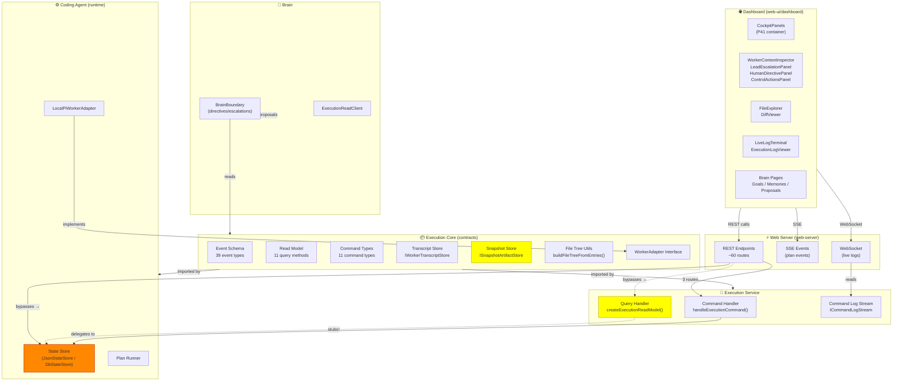

# P42 Interface Map — Current Repo State + Dashboard Summary

**Last updated:** 2026-06-01  
**What this is:** A wall-sized, visual inventory of every interface surface in the P40/P41 system — packages, endpoints, components, read models, events, controls, stubs, bypasses, and the gap between where we are and where P42 needs to go.  
**Who needs this:** Anyone starting P42. Don't touch the UI until the red and yellow items below are dealt with.

---

## Table of Contents

1. [System Architecture — Bird's Eye](#1-system-architecture--birds-eye)
2. [Package Boundary Map](#2-package-boundary-map)
3. [Package Health — Stoplight](#3-package-health--stoplight)
4. [Quick Stats](#4-quick-stats)
5. [Dashboard Route Map](#5-dashboard-route-map)
6. [Dashboard Component Map](#6-dashboard-component-map)
7. [Web Server Endpoint Map](#7-web-server-endpoint-map)
8. [Execution Service Command Map](#8-execution-service-command-map)
9. [Read Model Report Card](#9-read-model-report-card)
10. [Event Stream / SSE / WebSocket Map](#10-event-stream--sse--websocket-map)
11. [Worker Log / Transcript Interface Map](#11-worker-log--transcript-interface-map)
12. [File Tree / Diff Interface Map](#12-file-tree--diff-interface-map)
13. [Lead Agent / Escalation Interface Map](#13-lead-agent--escalation-interface-map)
14. [Human Directive / Control Action Map](#14-human-directive--control-action-map)
15. [Control Path Map — The Wire Diagram](#15-control-path-map--the-wire-diagram)
16. [Frontend Skillset Map](#16-frontend-skillset-map)
17. [Fake / Static / Stub Data Inventory](#17-fake--static--stub-data-inventory)
18. [Missing Interfaces](#18-missing-interfaces)
19. [Duplicated Interfaces](#19-duplicated-interfaces)
20. [Direct Internal Access / Boundary Violations](#20-direct-internal-access--boundary-violations)
21. [One-Page Heatmap](#21-one-page-heatmap)
22. [P42 Target Design Implications](#22-p42-target-design-implications)
23. [Recommended P42 Implementation Workspaces](#23-recommended-p42-implementation-workspaces)
24. [Priority Timeline](#24-priority-timeline)
25. [Appendix: Dashboard Hook Data Dependencies](#25-appendix-dashboard-hook-data-dependencies)
26. [Appendix: Event Payload Details](#26-appendix-event-payload-details)

---

## 1. System Architecture — Bird's Eye



---

## 2. Package Boundary Map

### 2.1 packages/execution-core
- **Role**: Canonical types, interfaces, event schema, command schema, read models
- **No runtime implementation** — pure contracts only
- **Key exports**:
  - `ExecutionReadModel` — 12 query methods for reading execution state
  - `ExecutionCommand` — 11 command types for mutating execution state
  - `ExecutionEvent` — 39 event type definitions with typed payloads
  - `ICommandLogStream` — pub/sub for live command output streaming
  - `IWorkerTranscriptStore` — persistence contract for worker transcript events
  - `ISnapshotArtifactStore` — persistence contract for pre/post file snapshots
  - `WorkerAdapter` — interface for executing workspace packets
  - `IStateStore` — minimal state store interface for execution-kernel
  - `BrainProposal` — typed proposal data structure
  - `buildFileTreeFromEntries()` — hierarchical file tree builder utility
  - `WorkspaceStage` enum — pending/active/complete/blocked/failed
  - `AgentRuntime`, `GovernanceProvider`, `StorageProvider`, `InfrastructureProvider`, `SkillProvider` — dependency inversion interfaces
  - `CompletionGateDeps`, `GovernanceLedgerLike`, `FailureDetectorLike`, `WatchModeGuardLike`, `StateStoreBackendFactoryLike`, `BudgetPolicyLike` — P40.2C dirty ports
- **Depends on**: Nothing from coding-agent. Zero runtime dependencies.
- **Location**: `packages/execution-core/src/` — 17 source files
- **Status**: ✅ **IMPLEMENTED** (extracted in P40, extended in P41 with event types, command types, read model interfaces)

### 2.2 packages/execution-service
- **Role**: Facade combining command handler + query handler + command log stream
- **Key exports**:
  - `createExecutionService()` — factory returning ExecutionService interface
  - `handleExecutionCommand()` — dispatches commands to injected deps
  - `createExecutionReadModel()` — creates read model backed by state store
- **Depends on**: execution-core (types), state store (injected at call sites)
- **Location**: `packages/execution-service/src/` — 6 source files
- **Status**: 🟡 **PARTIAL** (P40 extraction complete, but query handler has 5 stub methods)

### 2.3 packages/worker-adapters
- **Role**: Worker adapter implementations
- **Key exports**: `LocalPiWorkerAdapter`, `createLocalPiWorkerAdapter()`
- **Depends on**: execution-core (WorkerAdapter interface), coding-agent (for actual agent execution)
- **Location**: `packages/worker-adapters/src/` — 2 source files
- **Status**: ✅ **IMPLEMENTED** (P40 extraction). Single local adapter. No remote/docker adapter.

### 2.4 packages/brain
- **Role**: Lead Agent / Planner boundary. Creates proposals, directives, escalations.
- **Key exports**:
  - `BrainBoundary`, `createBrainBoundary()` — facade over execution read model with proposal factories
  - `BrainExecutionReadClient`, `createBrainExecutionReadClient()` — HTTP client for reading execution state
  - `createRetryProposal()`, `createDirectiveProposal()`, `createEscalationProposal()`, `createInvestigateProposal()` — typed proposal factories
  - `validateProposedCommand()` — command validation utility
- **Depends on**: execution-core (ExecutionReadModel)
- **Location**: `packages/brain/src/` — 4 source files
- **Status**: ✅ **IMPLEMENTED** (P40 extraction). BrainBoundary is a thin proposal factory. Real Brain logic (observation, reflection, policy) lives in coding-agent/brain pathway.

### 2.5 packages/coding-agent
- **Role**: Full agent runtime, plan execution, state store implementations
- **Key exports (not extracted)**:
  - `JsonStateStore`, `DbStateStore` — state store implementations
  - Plan executor, plan runner, completion gate
  - Safety doctor, policy engine
  - Worker agent runtime
  - Lead Agent implementation
- **Depends on**: execution-core (types), execution-service (command/query handlers)
- **Status**: 🟠 **MONOLITH** (P40 extraction defined interfaces, implementations remain here — ~30,000+ lines)

### 2.6 packages/web-server
- **Role**: REST API + SSE + WebSocket for dashboard
- **Key routes**: ~60 endpoint groups in 25+ route files
- **Depends on**: execution-service (handleExecutionCommand, createExecutionReadModel), coding-agent (state store, plan runner, JsonStateStore)
- **Location**: `packages/web-server/src/` — 35+ source files
- **Status**: 🟡 **BYPASSES BOUNDARIES** (~7 direct state store accesses instead of using execution-service)

### 2.7 packages/web-ui/dashboard
- **Role**: React + TypeScript SPA dashboard
- **Key components**: ~80+ components in 60+ files
- **Location**: `packages/web-ui/dashboard/src/` — 3 feature directories, 8+ component subdirectories, 50+ hooks
- **Status**: 🟡 **MIXED** — some panels consume real APIs, others bypass or use fake/static data

---

## 3. Package Health — Stoplight

| Package | Lines | Role | Health | Key Issue |
|---|---|---|---|---|
| `execution-core` | ~4,500 | Contracts only — no runtime | ✅ **CLEAN** | None. Well-defined interfaces. |
| `execution-service` | ~600 | Command + query facade | 🟡 **STUBS** | 5 query methods are stubs returning `[]` or `null` |
| `worker-adapters` | ~200 | Worker adapter implementations | ✅ **CLEAN** | Single local adapter only |
| `brain` | ~300 | Lead Agent boundary | ✅ **CLEAN** | Thin factory — real logic in coding-agent |
| `coding-agent` | 30,000+ | Runtime + state store | 🟠 **MONOLITH** | Not extracted — everything depends on it |
| `web-server` | 5,400+ | REST/SSE/WS API | 🟡 **BYPASSES** | ~7 boundary violations — reads state store directly |
| `web-ui/dashboard` | 15,000+ | React SPA | 🟡 **MIXED** | ~80+ components, some use real APIs, some bypass |
| `db` | ~500 | PostgreSQL backend | ✅ **CLEAN** | Used by DbStateStore |
| `agent` | ~200 | Agent package | ✅ **CLEAN** | Minimal extraction |
| `ai` | ~5,000 | AI provider integration | ✅ **CLEAN** | Separate concern |
| `tui` | ~3,000 | Terminal UI | ✅ **CLEAN** | Separate concern |
| `execution-kernel` | ~500 | Kernel extraction | ✅ **CLEAN** | Thin extraction |

---

## 4. Quick Stats

```
    Total packages:              12
    Interface packages:           4  (execution-core, execution-service, worker-adapters, brain)
    Runtime monolith:             1  (coding-agent)
    Web layer:                    2  (web-server, web-ui/dashboard)

    Total endpoints:             ~60
    Endpoints bypassing boundary: ~7
    Endpoints using execution-service: 3

    Read model methods:          12
    Read model stubs:             6  (50% stub rate)
    Read model methods bypassed by dashboard: 2

    Dashboard components:        ~80
    Components on real APIs:     ~60
    Components bypassing:        ~5

    Event types:                 39
    Plan events:                  7
    Workspace events:             9
    Worker events:                5
    Command events:               3
    Brain events:                 3
    Governance events:            4
    Lead Agent events:            5
    Human directive events:       3
    System events:                3

    Control paths:               3
    Correct control paths:       1  (human-directive-routes.ts)
    Broken/legacy control paths: 2  (/api/control, /api/executions/:id/control)

    Snapshot artifact stores:    1  (InMemorySnapshotArtifactStore)
    Snapshot web endpoints:      0  (doesn't exist)

    Dashboard hooks:             50+
    Dashboard components:        80+
    Custom types files:          3+  (types.ts, types-brain.ts, types-transcript.ts)
    API client files:            2+  (api/brain.ts, api/...)
```

---

## 5. Dashboard Route Map

### 5.1 Legacy Routes (used when no project selected)

| Route/Path | Owning File | Data Source | Live Source | Mutation Source | Status | Notes |
|---|---|---|---|---|---|---|
| `GET /api/plan-state` | `index.ts` | `.pi/plan-state.json` | None (polling) | None | ✅ IMPLEMENTED | No-project mode |
| `GET /api/events` | `index.ts` | `.pi/execution-journal.ndjson` | File watcher SSE | None | ✅ IMPLEMENTED | Legacy SSE |
| `GET /api/logs/:wsId/:attempt/:stream` | `index.ts` | `.pi/workspaces/.../*.log` | File watcher SSE | None | ✅ IMPLEMENTED | Falls back to state store |
| `POST /api/control` | `index.ts` | `.pi/plan-control.json` | None | File write | ✅ IMPLEMENTED | Only pause/stop/cancel/resume |

### 5.2 Project Routes

| Route/Path | Owning File | Data Source | Live Source | Mutation Source | Status | Notes |
|---|---|---|---|---|---|---|
| `GET /api/projects` | `index.ts` | State store | None | None | ✅ | |
| `POST /api/projects` | `index.ts` | State store | None | POST | ✅ | |
| `GET /api/projects/:pid/plans` | `index.ts` | State store + meta files | None | None | ✅ | Enriched with archive status |
| `GET /api/projects/:pid/plans/:peid` | `index.ts` | State store + log files + git | None | None | ✅ | Enriched with context/git |
| `GET /api/projects/:pid/plans/:peid/batch-plan` | `index.ts` | Workspace queue file | None | None | ✅ | |
| `GET /api/projects/:pid/plans/:peid/events` | `index.ts` | State store journal | SSE (PG or file) | None | ✅ | Dual backend |
| `GET /api/projects/:pid/plans/:peid/stats` | `index.ts` | State store | None | None | ✅ | |
| `GET /api/projects/:pid/plans/:peid/journal` | `index.ts` | State store journal | None | None | ✅ | Paginated |
| `GET /api/projects/:pid/plans/:peid/workspaces` | `index.ts` | State store + logs + git | None | None | ✅ | |
| `GET /api/projects/:pid/plans/:peid/workspaces/:wsId` | `index.ts` | State store + logs + git | None | None | ✅ | |
| `GET /.../workspaces/:wsId/attempts` | `index.ts` | State store | None | None | ✅ | |
| `GET /.../workspaces/:wsId/git-diff` | `index.ts` | Git (local) | None | None | ✅ | `?format=patch` for unified diff |
| `GET /.../workspaces/:wsId/logs` | `index.ts` | State store buffer or file | None | None | ✅ | |
| `GET /api/ws/logs/:peid/:wsId` | `index.ts` | State store buffer + file | WebSocket (poll) | None | ✅ | Cursor-aware |
| `GET /api/log-stream/:peid/:wsId/recent` | `log-stream-routes.ts` | File system | None | None | ✅ | Path traversal protection |
| `GET /api/log-stream/:peid/:wsId/live` | `log-stream-routes.ts` | File system | SSE | None | ✅ | |
| `GET /api/transcript/:peid/:wsId` | `index.ts` | Transcript file | SSE | None | ✅ | Worker transcript stream |

### 5.3 Plan Intake / Queue Routes

| Route/Path | Owning File | Data Source | Mutation | Status |
|---|---|---|---|---|
| `POST /api/projects/:pid/plans/validate` | `index.ts` | Plan parser | None | ✅ |
| `PATCH /api/projects/:pid/plans/preview` | `index.ts` | Plan parser | PATCH | ✅ |
| `POST /api/projects/:pid/plans/run` | `index.ts` | Plan runner | POST (run) | ✅ |
| `GET /api/projects/:pid/active` | `index.ts` | State store | None | ✅ |
| `GET /api/projects/:pid/queue` | `index.ts` | State store | None | ✅ |
| `POST /api/projects/:pid/queue/enqueue` | `index.ts` | State store | POST | ✅ |
| `POST /api/projects/:pid/queue/reorder` | `index.ts` | State store | POST | ✅ |
| `DELETE /api/projects/:pid/queue/:entryId` | `index.ts` | State store | DELETE | ✅ |
| `POST /api/projects/:pid/queue/:entryId/move-to-top` | `index.ts` | State store | POST | ✅ |
| `POST /api/projects/:pid/queue/:entryId/skip` | `index.ts` | State store | POST | ✅ |
| `POST /api/projects/:pid/queue/run-next` | `index.ts` | State store | POST | ✅ |
| `POST /api/projects/:pid/queue/pause` | `index.ts` | State store | POST | ✅ |
| `POST /api/projects/:pid/queue/resume` | `index.ts` | State store | POST | ✅ |
| `POST /api/projects/:pid/queue/stop-after-current` | `index.ts` | State store | POST | ✅ |

### 5.4 Control / Human Directive Routes

| Route/Path | Owning File | Goes Through Execution-Service? | Status | Notes |
|---|---|---|---|---|
| `POST /api/control` | `index.ts` | ❌ No (writes control file) | ✅ | Legacy |
| `POST /api/executions/:peid/control` | `index.ts` | ❌ No (writes control file + state store) | 🟡 PARTIAL | Project mode |
| `POST /api/human/directive` | `human-directive-routes.ts` | ✅ Yes | ✅ | |
| `GET /api/human/directives/:peid/:wsId` | `human-directive-routes.ts` | ❌ No (reads state store) | ✅ | |
| `POST /api/human/escalations/:escId/resolve` | `human-directive-routes.ts` | ✅ Yes | ✅ | |
| `GET /api/human/escalations/:peid/:wsId` | `human-directive-routes.ts` | ❌ No (reads state store) | ✅ | |
| `POST /api/human/intervene/:peid/:wsId` | `human-directive-routes.ts` | ✅ Yes | ✅ | |
| `POST /api/projects/:pid/plans/:peid/rerun` | `index.ts` | ❌ No (calls plan runner) | ✅ | |

### 5.5 Worker Context Routes

| Route/Path | Owning File | Data Source | Status |
|---|---|---|---|
| `GET /api/projects/:pid/worker-context/:peid/:wsId` | `worker-context-routes.ts` | State store + archive files + git | ✅ IMPLEMENTED |
| `GET /api/worker-context/:peid/:wsId` | `worker-context-routes.ts` | Same (global variant) | ✅ IMPLEMENTED |

### 5.6 Brain Routes (20+)

| Route Group | File | Data Source | Status |
|---|---|---|---|
| `/api/brain/*` (global) | `brain-v5-routes.ts` + sub-routes | Brain state store + DB | ✅ Full CRUD |
| `/api/projects/:pid/brain/*` (scoped) | Same files | Same (project-scoped) | ✅ Full CRUD |
| `/api/brain/goals/*` | `goal-routes.ts` | Brain state store | ✅ Full CRUD |
| `/api/brain/memories/*` | `memory-routes.ts` | Brain state store | ✅ Full CRUD |
| `/api/brain/proposals/*` | `proposal-routes.ts` | Brain state store | ✅ Full CRUD |
| `/api/brain/feedback/*` | `feedback-routes.ts` | Brain state store | ✅ Full CRUD |
| `/api/brain-v5/*` | `brain-v5-routes.ts` | Brain state store | ✅ Full CRUD |

### 5.7 Other Routes

| Route Group | File | Status |
|---|---|---|
| `/api/activity-timeline/*` | `activity-timeline-routes.ts` | ✅ |
| `/api/artifacts/*` | `artifact-routes.ts` | ✅ |
| `/api/auth/*` | `auth-routes.ts` | ✅ |
| `/api/brain-worker/*` | `brain-worker-routes.ts` | ✅ |
| `/api/extensions/*` | `extensions-routes.ts` | ✅ |
| `/api/file-explorer/*` | `file-explorer-routes.ts` | ✅ |
| `/api/scale/*` | `scale-routes.ts` | ✅ |
| `/api/performance/*` | `performance-routes.ts` | ✅ |
| `/api/pi-inbox/*` | `pi-inbox-routes.ts` | ✅ |
| `/api/policy-audit/*` | `policy-audit-routes.ts` | ✅ |
| `/api/notifications/*` | `notification-routes.ts` | ✅ |
| `/api/skills/*` | `skills-routes.ts` | 🟡 PARTIAL |
| `/api/trust/*` | `trust-routes.ts` | ✅ |
| `/api/telemetry/*` | `telemetry-routes.ts` | ✅ |
| `/api/local-readiness/*` | `local-readiness-routes.ts` | ✅ |
| `/api/digest/actions/*` | `digest-action-routes.ts` | ✅ |
| `/api/orchestrator/*` | `orchestrator-routes.ts` | 🟡 PARTIAL |
| `/api/projects/:pid/tasks/*` | `index.ts` + task store | ✅ |
| `/api/projects/:pid/plans/:peid/stats` | `index.ts` | ✅ |
| `/api/projects/:pid/plans/:peid/batch-plan` | `index.ts` | ✅ |

---

## 6. Dashboard Component Map

### 6.1 P41 Cockpit Panels

| Component | Panel/Function | API Endpoint(s) | Event Stream | Control Action | Status | Refactor Risk |
|---|---|---|---|---|---|---|
| `CockpitPanels.tsx` | Container for all cockpit panels | Delegates to children | Delegates | Delegates | ✅ IMPLEMENTED | 🟢 LOW |
| `PlanSummaryPanel.tsx` | Plan overview summary | `GET /api/projects/:pid/plans/:peid` | None | None | ✅ IMPLEMENTED | 🟢 LOW |
| `WorkerContextInspector.tsx` | Worker context (P41.08) | `GET /api/worker-context/:peid/:wsId` | None | None | ✅ IMPLEMENTED | 🟢 LOW |
| `LeadEscalationPanel.tsx` | Escalations (P41.09) | `GET /api/human/escalations/:peid/:wsId` | None | `resolve_escalation` | ✅ IMPLEMENTED | 🟢 LOW |
| `HumanDirectivePanel.tsx` | Human directives (P41.10) | `GET /api/human/directives/:peid/:wsId` | None | `issue_human_directive` | ✅ IMPLEMENTED | 🟢 LOW |
| `ControlActionsPanel.tsx` | Control actions (P41.11) | `POST /api/human/intervene/:peid/:wsId` | None | stop/pause/cancel/retry | ✅ IMPLEMENTED | 🟢 LOW |
| `LiveLogTerminal.tsx` | Live log streaming | WebSocket `/api/ws/logs/:peid/:wsId` | WebSocket | None | ✅ IMPLEMENTED | 🟢 LOW |
| `FileExplorer.tsx` | File tree browser | `GET .../git-diff` | None | None | ✅ IMPLEMENTED | 🟡 MEDIUM |
| `DiffViewer.tsx` | Diff viewer | `GET .../git-diff?format=patch` | None | None | ✅ IMPLEMENTED | 🟡 MEDIUM |

### 6.2 Plan Execution Components

| Component | API Endpoint(s) | Status | Notes |
|---|---|---|---|
| `WorkerDetail.tsx` | `GET /api/projects/:pid/plans/:peid/workspaces/:wsId` | ✅ | Enriched with context/git |
| `WorkerList.tsx` | Derived from plan detail | ✅ | |
| `ExecutionLogViewer.tsx` | `GET /api/projects/:pid/plans/:peid/workspaces/:wsId/logs` | ✅ | WebSocket upgrade |
| `QueuePanel.tsx` | Derived from plan detail | ✅ | |
| `SchedulerStatusPanel.tsx` | `GET /api/projects/:pid/plans/:peid/stats` | ✅ | |
| `WarningBanner.tsx` | Derived from detail + stats + events | ✅ | Computed from real data |
| `PlanSummary.tsx` | Derived | ✅ | |
| `PlanUploadDialog.tsx` | `POST /api/projects/:pid/plans/run` | ✅ | |
| `PlanHistory.tsx` | Derived from executions list | ✅ | |
| `RerunDialog.tsx` | `POST /api/projects/:pid/plans/:peid/rerun` | ✅ | |
| `ForceKillDialog.tsx` | `POST /api/control` | ✅ | Legacy endpoint |
| `ControlButtons.tsx` | `POST /api/control` or `/api/executions/:id/control` | ✅ | Dual path |
| `EventFeed.tsx` | Plan events SSE | ✅ | |
| `EventLine.tsx` | Derived | ✅ | |

### 6.3 Dialogs and Overlays

| Component | API Endpoint(s) | Status |
|---|---|---|
| `OpenProjectDialog.tsx` | `POST /api/projects` | ✅ |
| `SettingsDialog.tsx` | Settings API | ✅ |
| `TaskCreationStudio.tsx` | `POST /api/projects/:pid/tasks` | ✅ |

### 6.4 Scale / Performance Components

| Component | API Endpoint(s) | Status |
|---|---|---|
| `ScaleCockpitPanel.tsx` | `GET/POST /api/scale/*` | ✅ |
| `ScaleModeSettings.tsx` | `GET/POST /api/scale/*` | ✅ |
| `ScaleOverviewStrip.tsx` | `GET /api/scale/*` | ✅ |
| `PerformancePanel.tsx` | `GET /api/performance/*` | ✅ |

### 6.5 Brain / Platform Components

| Component | API Endpoint(s) | Status |
|---|---|---|
| `BrainStatePage.tsx` | `GET /api/brain/state` | ✅ |
| `BrainMemoryPage.tsx` | `GET/POST /api/brain/memories/*` | ✅ |
| `BrainReflectionsPage.tsx` | `GET /api/brain/reflections` | ✅ |
| `BrainTrustPage.tsx` | `GET /api/brain/trust` | ✅ |
| `BrainOvernightPage.tsx` | `GET/POST /api/brain/overnight/*` | ✅ |
| `DigestPage.tsx` | `GET /api/brain/digest` | ✅ |
| `BrainInboxPage.tsx` | `GET /api/brain/inbox` | ✅ |
| `GoalBoard.tsx` | `GET/POST /api/brain/goals/*` | ✅ |
| `ProposalInbox.tsx` | `GET/POST /api/brain/proposals/*` | ✅ |
| `AutonomyCenter.tsx` | `GET/PATCH /api/brain/autonomy/*` | ✅ |
| `PolicyAuditCenter.tsx` | `GET /api/policy-audit/*` | ✅ |
| `ObservabilityCockpit.tsx` | Multiple observability endpoints | ✅ |
| `PiInbox.tsx` | `GET/POST /api/pi-inbox/*` | ✅ |
| `TrustDashboard.tsx` | `GET /api/brain/trust` | ✅ |
| `TaskDetailView.tsx` | `GET /api/projects/:pid/tasks/:taskId` | ✅ |

### 6.6 Other Components

| Component | Status | Notes |
|---|---|---|
| `ActivityDot.tsx` | ✅ | Visual indicator |
| `ArtifactBrowser.tsx` | ✅ | |
| `BatchExplorer.tsx` | ✅ | |
| `BatchOSDashboard.tsx` | ✅ | |
| `BlockedReasonPanel.tsx` | ✅ | |
| `BrainContextPanel.tsx` | ✅ | |
| `ChatPanel.tsx` | ✅ | |
| `CommandsPanel.tsx` | ✅ | |
| `DagDiffViewer.tsx` | ✅ | |
| `EditFailureHandoff.tsx` | ✅ | |
| `EditStrategyWarnings.tsx` | ✅ | |
| `ExtensionsManager.tsx` | ✅ | |
| `FileSelectScreen.tsx` | ✅ | |
| `Header.tsx` | ✅ | |
| `HistoryItem.tsx` | ✅ | |
| `IntegrationQueuePanel.tsx` | ✅ | |
| `LeadAgentDashboard.tsx` | ✅ | |
| `LeftNav.tsx` | ✅ | |
| `LogViewer.tsx` | ✅ | |
| `MergeConflictPanel.tsx` | ✅ | |
| `MultiDagViewer.tsx` | ✅ | |
| `OptimizerApprovalPanel.tsx` | ✅ | |
| `PlanIntakePanel.tsx` | ✅ | |
| `PlanQueueTab.tsx` | ✅ | |
| `PlanValidationPanel.tsx` | ✅ | |
| `SkillsManager.tsx` | ✅ | |
| `TaskAggregatesBar.tsx` | ✅ | |
| `TaskCard.tsx` | ✅ | |
| `TaskCreateDialog.tsx` | ✅ | |
| `TaskList.tsx` | ✅ | |
| `WorkerP6LifecycleTab.tsx` | ✅ | |
| `WorktreeCleanupDialog.tsx` | ✅ | |
| `WorktreeStatusPanel.tsx` | ✅ | |

---

## 7. Web Server Endpoint Map

### 7.1 Legacy Endpoints

| Method | Path | Handler | Returns | Mutates? | Goes Through ES? |
|---|---|---|---|---|---|
| GET | `/api/plan-state` | `index.ts` inline | LegacyPlanState | ❌ | ❌ |
| GET | `/api/events` | `index.ts` inline | SSE stream | ❌ | ❌ |
| GET | `/api/logs/:wsId/:attempt/:stream` | `index.ts` inline | SSE stream | ❌ | ❌ |
| POST | `/api/control` | `index.ts` inline | `{success}` | ✅ (control file) | ❌ |

### 7.2 Project CRUD + Plan Execution Endpoints

| Method | Path | Handler | Returns | Mutates? | Goes Through ES? |
|---|---|---|---|---|---|
| GET | `/api/projects` | `index.ts` inline | `{projects}` | ❌ | ❌ |
| POST | `/api/projects` | `index.ts` inline | Project | ✅ | ❌ |
| GET | `/api/projects/:pid/plans` | `index.ts` inline | `{executions}` | ❌ | ❌ |
| GET | `/api/projects/:pid/plans/:peid` | `index.ts` inline | Plan detail | ❌ | ❌ |
| GET | `/api/projects/:pid/plans/:peid/batch-plan` | `index.ts` inline | BatchPlan | ❌ | ❌ |
| GET | `/api/projects/:pid/plans/:peid/events` | `index.ts` inline | SSE stream | ❌ | ❌ |
| GET | `/api/projects/:pid/plans/:peid/stats` | `index.ts` inline | Stats | ❌ | ❌ |
| GET | `/api/projects/:pid/plans/:peid/journal` | `index.ts` inline | `{events}` | ❌ | ❌ |
| GET | `/api/projects/:pid/plans/:peid/workspaces` | `index.ts` inline | `{workspaces}` | ❌ | ❌ |
| GET | `/api/projects/:pid/plans/:peid/workspaces/:wsId` | `index.ts` inline | Workspace detail | ❌ | ❌ |
| GET | `/api/projects/:pid/plans/:peid/workspaces/:wsId/attempts` | `index.ts` inline | `{attempts}` | ❌ | ❌ |
| GET | `/api/projects/:pid/plans/:peid/workspaces/:wsId/git-diff` | `index.ts` inline | `{filesChanged}` or `{patches}` | ❌ | ❌ |
| GET | `/api/projects/:pid/plans/:peid/workspaces/:wsId/logs` | `index.ts` inline | `{logs}` | ❌ | ❌ |
| GET | `/api/ws/logs/:peid/:wsId` | `index.ts` inline | WebSocket | ❌ | ❌ |
| POST | `/api/projects/:pid/plans/validate` | `index.ts` inline | Validation | ❌ | ❌ |
| PATCH | `/api/projects/:pid/plans/preview` | `index.ts` inline | Preview | ❌ | ❌ |
| POST | `/api/projects/:pid/plans/run` | `index.ts` inline | `{planExecutionId}` | ✅ | ❌ |
| GET | `/api/projects/:pid/active` | `index.ts` inline | Active execution | ❌ | ❌ |
| POST | `/api/projects/:pid/plans/:peid/rerun` | `index.ts` inline | `{planExecutionId}` | ✅ | ❌ |

### 7.3 Queue Endpoints

| Method | Path | Mutates? | Goes Through ES? |
|---|---|---|---|
| GET | `/api/projects/:pid/queue` | ❌ | ❌ |
| POST | `/api/projects/:pid/queue/enqueue` | ✅ | ❌ |
| POST | `/api/projects/:pid/queue/reorder` | ✅ | ❌ |
| DELETE | `/api/projects/:pid/queue/:entryId` | ✅ | ❌ |
| POST | `/api/projects/:pid/queue/:entryId/move-to-top` | ✅ | ❌ |
| POST | `/api/projects/:pid/queue/:entryId/skip` | ✅ | ❌ |
| POST | `/api/projects/:pid/queue/run-next` | ✅ | ❌ |
| POST | `/api/projects/:pid/queue/pause` | ✅ | ❌ |
| POST | `/api/projects/:pid/queue/resume` | ✅ | ❌ |
| POST | `/api/projects/:pid/queue/stop-after-current` | ✅ | ❌ |

### 7.4 Control / Human Directive Endpoints

| Method | Path | Mutates? | Goes Through ES? |
|---|---|---|---|
| POST | `/api/executions/:peid/control` | ✅ | ❌ |
| POST | `/api/human/directive` | ✅ | ✅ |
| GET | `/api/human/directives/:peid/:wsId` | ❌ | ❌ |
| POST | `/api/human/escalations/:escId/resolve` | ✅ | ✅ |
| GET | `/api/human/escalations/:peid/:wsId` | ❌ | ❌ |
| POST | `/api/human/intervene/:peid/:wsId` | ✅ | ✅ |

### 7.5 Worker Context Endpoints

| Method | Path | Returns | Mutates? | Goes Through ES? |
|---|---|---|---|---|
| GET | `/api/projects/:pid/worker-context/:peid/:wsId` | WorkerContextView | ❌ | ❌ |
| GET | `/api/worker-context/:peid/:wsId` | WorkerContextView | ❌ | ❌ |

### 7.6 Log / Transcript Endpoints

| Method | Path | Returns | Mutates? |
|---|---|---|---|
| GET | `/api/log-stream/:peid/:wsId/recent` | `{logs}` | ❌ |
| GET | `/api/log-stream/:peid/:wsId/live` | SSE stream | ❌ |
| GET | `/api/transcript/:peid/:wsId` | SSE stream | ❌ |

### 7.7 Brain / Platform Endpoints (Grouped)

| Route Group | File | Mutates? |
|---|---|---|
| `/api/brain/*` (global, 20+ routes) | `brain-v5-routes.ts` + sub-routes | ✅ on POST |
| `/api/projects/:pid/brain/*` (scoped) | Same as above | ✅ on POST |
| `/api/goals/*` | `goal-routes.ts` | ✅ on POST |
| `/api/brain/goals/*` | `goal-routes.ts` | ✅ on POST |
| `/api/memories/*` | `memory-routes.ts` | ✅ on POST |
| `/api/brain/memories/*` | `memory-routes.ts` | ✅ on POST |
| `/api/proposals/*` | `proposal-routes.ts` | ✅ on POST |
| `/api/brain/proposals/*` | `proposal-routes.ts` | ✅ on POST |
| `/api/feedback/*` | `feedback-routes.ts` | ✅ on POST |
| `/api/brain/feedback/*` | `feedback-routes.ts` | ✅ on POST |
| `/api/policy-audit/*` | `policy-audit-routes.ts` | ✅ on POST |
| `/api/activity-timeline/*` | `activity-timeline-routes.ts` | ❌ |
| `/api/artifacts/*` | `artifact-routes.ts` | ❌ |
| `/api/auth/*` | `auth-routes.ts` | ✅ on POST |
| `/api/brain-worker/*` | `brain-worker-routes.ts` | ✅ on POST |
| `/api/extensions/*` | `extensions-routes.ts` | ✅ on POST |
| `/api/file-explorer/*` | `file-explorer-routes.ts` | ❌ |
| `/api/scale/*` | `scale-routes.ts` | ✅ on POST |
| `/api/performance/*` | `performance-routes.ts` | ❌ |
| `/api/pi-inbox/*` | `pi-inbox-routes.ts` | ✅ on POST |
| `/api/notifications/*` | `notification-routes.ts` | ❌ |
| `/api/skills/*` | `skills-routes.ts` | ✅ on POST |
| `/api/trust/*` | `trust-routes.ts` | ❌ |
| `/api/telemetry/*` | `telemetry-routes.ts` | ❌ |
| `/api/local-readiness/*` | `local-readiness-routes.ts` | ❌ |
| `/api/digest/actions/*` | `digest-action-routes.ts` | ✅ on POST |
| `/api/orchestrator/*` | `orchestrator-routes.ts` | ✅ on POST |

---

## 8. Execution Service Command Map

### 8.1 Command Definitions

| Command Type | Interface | File | Input Fields |
|---|---|---|---|
| `start_plan` | `ExecutionCommandStartPlan` | `commands.ts` | `planId` |
| `stop_plan` | `ExecutionCommandStopPlan` | `commands.ts` | `planExecutionId`, `reason?` |
| `continue_plan` | `ExecutionCommandContinuePlan` | `commands.ts` | `planExecutionId`, `reason?` |
| `rerun_plan` | `ExecutionCommandRerunPlan` | `commands.ts` | `planExecutionId`, `reason?` |
| `retry_workspace` | `ExecutionCommandRetryWorkspace` | `commands.ts` | `planExecutionId`, `workspaceId`, `reason?` |
| `request_user_escalation` | `ExecutionCommandRequestUserEscalation` | `commands.ts` | `planExecutionId`, `workspaceId`, `reason?` |
| `approve_proposal` | `ExecutionCommandApproveProposal` | `commands.ts` | `proposalId` |
| `acknowledge_directive` | `ExecutionCommandAcknowledgeDirective` | `commands.ts` | `planExecutionId`, `workspaceId`, `directiveId`, `attemptNumber` |
| `resolve_escalation` | `ExecutionCommandResolveEscalation` | `commands.ts` | `planExecutionId`, `workspaceId`, `escalationId`, `chosenOptionId`, `userResponse?` |
| `issue_human_directive` | `ExecutionCommandIssueHumanDirective` | `commands.ts` | `planExecutionId`, `workspaceId`, `directive`, `severity?`, `directiveId?` |
| `intervene_workspace` | `ExecutionCommandInterveneWorkspace` | `commands.ts` | `planExecutionId`, `workspaceId`, `action`, `reason?` |

### 8.2 Command Handler Details

| Command | Handler Logic | Deps Required | Mutates State? | Emits Events? | Used By |
|---|---|---|---|---|---|
| `start_plan` | Returns accepted | None | ✅ (delegates to plan runner) | ❌ | Plan runner |
| `stop_plan` | Writes control request via `planControlManager` | `planControlManager` | ✅ | ❌ | Web control endpoints |
| `continue_plan` | Writes control request via `planControlManager` | `planControlManager` | ✅ | ❌ | Web control endpoints |
| `rerun_plan` | Writes cancel control request | `planControlManager` | ✅ | ❌ | RerunDialog |
| `retry_workspace` | Transitions workspace to Pending | `transitionRouter` | ✅ | ❌ | ControlActionsPanel |
| `request_user_escalation` | Returns accepted (no-op) | None | ❌ **NO-OP** | ❌ | Brain (Lead Agent) |
| `approve_proposal` | Returns accepted (no-op) | None | ❌ **NO-OP** | ❌ | ProposalInbox |
| `acknowledge_directive` | Delegates to `directiveManager` | `directiveManager` | ✅ | ❌ | Worker agent |
| `resolve_escalation` | Delegates to `escalationManager` | `escalationManager` | ✅ | ❌ | LeadEscalationPanel |
| `issue_human_directive` | Writes control request with directive payload | `planControlManager` | ✅ | ❌ | HumanDirectivePanel |
| `intervene_workspace` | Writes control request with action payload | `planControlManager` | ✅ | ❌ | ControlActionsPanel |

### 8.3 Command Handler Gaps

| Gap | Impact | Priority |
|---|---|---|
| No commands emit events through the event system | Events are emitted by plan runner/executor, not through command handler | 🟡 MEDIUM |
| `approve_proposal` is a no-op | Approving proposals does nothing | 🔴 HIGH |
| `request_user_escalation` is a no-op | Escalation requests go nowhere | 🔴 HIGH |
| All deps are injected (nullable) | If deps aren't wired, commands silently return accepted without doing anything | 🟡 MEDIUM |

---

## 9. Read Model Report Card

### 9.1 All Methods

| # | Method | Status | Real Data? | Data Source | Dashboard Consumer(s) | Notes |
|---|---|---|---|---|---|---|
| 1 | `getPlanSummary()` | ✅ IMPLEMENTED | ✅ Yes | State store `getPlanExecutionSummary()` | Plan detail endpoint | |
| 2 | `getWorkspaceSummary()` | ✅ IMPLEMENTED | ✅ Yes | State store `getWorkspaceState()` | Workspace detail endpoint | |
| 3 | `listJournalEvents()` | ✅ IMPLEMENTED | ✅ Yes | State store `getJournalEvents()` | EventFeed, journal endpoint | |
| 4 | `getWorkerContext()` | ✅ IMPLEMENTED | ✅ Yes | Combines workspace + directives + escalations | WorkerContextInspector (via web-server) | |
| 5 | `getChangedFiles()` | ✅ IMPLEMENTED | ✅ Yes | Worker_completed journal events | File tree builder | |
| 6 | `getFileTree()` | ✅ IMPLEMENTED | ✅ Yes | Same as getChangedFiles, then builds tree | FileExplorer (bypasses!) | Dashboard reads git directly |
| 7 | `getCommandHistory()` | ❌ **STUB** | ❌ No | Always returns `[]` | WorkerDetail (missing data) | |
| 8 | `getLeadDirectives()` | ❌ **STUB** | ❌ No | Always returns `[]` | LeadEscalationPanel, WorkerContextInspector | |
| 9 | `getLeadEscalations()` | ❌ **STUB** | ❌ No | Always returns `[]` | LeadEscalationPanel, WorkerContextInspector | |
| 10 | `getFinalValidationStatus()` | ❌ **STUB** | ❌ No | Returns default `{required, passed, blocked}` | Validation panels | |
| 11 | `getFileContent()` | ❌ **STUB** | ❌ No | Always returns `null` | File preview (missing) | |
| 12 | `getFileDiff()` | ❌ **STUB** | ❌ No | Always returns `[]` | DiffViewer (bypasses!) | Dashboard reads git directly |

### 9.2 Summary

```
Read model methods:          12
Working:                      6  (50%)
Stubs:                        6  (50%)
Bypassed by dashboard:        2  (getFileTree, getFileDiff — dashboard uses git directly)
Consumer components affected: 6+ (WorkerDetail, LeadEscalationPanel, WorkerContextInspector, 
                                   FileExplorer, DiffViewer, validation panels)
```

### 9.3 What's Needed to Fix Each Stub

| Stub Method | What's Needed |
|---|---|
| `getCommandHistory()` | State store must expose command history (from command events or execution archive) |
| `getLeadDirectives()` | State store must expose lead directive events as a queryable collection |
| `getLeadEscalations()` | State store must expose lead escalation events as a queryable collection |
| `getFinalValidationStatus()` | State store must expose completion gate state |
| `getFileContent()` | Need file system access or archive retrieval (injected via adapter) |
| `getFileDiff()` | Need git diff computation or snapshot comparison |

---

## 10. Event Stream / SSE / WebSocket Map

### 10.1 Event Type Catalog

```
EVENT TYPE              │ CATEGORY    │ PAYLOAD INTERFACE
────────────────────────┼─────────────┼────────────────────────────────
plan_started            │ Plan        │ PlanStartedPayload
plan_completed          │ Plan        │ PlanCompletedPayload
plan_failed             │ Plan        │ PlanFailedPayload
plan_paused             │ Plan        │ PlanPausedPayload
plan_resumed            │ Plan        │ PlanResumedPayload
plan_cancelled          │ Plan        │ PlanCancelledPayload
plan_stopped            │ Plan        │ PlanStoppedPayload
────────────────────────┼─────────────┼────────────────────────────────
workspace_pending       │ Workspace   │ WorkspaceStageChangedPayload
workspace_running       │ Workspace   │ WorkspaceStageChangedPayload
workspace_completed     │ Workspace   │ WorkspaceStageChangedPayload
workspace_failed        │ Workspace   │ WorkspaceStageChangedPayload
workspace_blocked       │ Workspace   │ WorkspaceStageChangedPayload
workspace_cancelled     │ Workspace   │ WorkspaceStageChangedPayload
workspace_skipped       │ Workspace   │ WorkspaceStageChangedPayload
workspace_paused        │ Workspace   │ WorkspaceStageChangedPayload
workspace_timed_out     │ Workspace   │ WorkspaceStageChangedPayload
────────────────────────┼─────────────┼────────────────────────────────
worker_started          │ Worker      │ WorkerStartedPayload
worker_completed        │ Worker      │ WorkerCompletedPayload
worker_failed           │ Worker      │ WorkerFailedPayload
worker_timed_out        │ Worker      │ WorkerTimedOutPayload
worker_cancelled        │ Worker      │ WorkerCancelledPayload
────────────────────────┼─────────────┼────────────────────────────────
command_started         │ Command     │ CommandStartedPayload
command_finished        │ Command     │ CommandFinishedPayload
command_output          │ Command     │ CommandOutputPayload
────────────────────────┼─────────────┼────────────────────────────────
brain_proposed          │ Brain       │ BrainProposedPayload
brain_approved          │ Brain       │ BrainApprovedPayload
brain_rejected          │ Brain       │ BrainRejectedPayload
────────────────────────┼─────────────┼────────────────────────────────
governance_check_started│ Governance  │ GovernanceCheckStartedPayload
governance_approved     │ Governance  │ GovernanceApprovedPayload
governance_rejected     │ Governance  │ GovernanceRejectedPayload
governance_escalated    │ Governance  │ GovernanceEscalatedPayload
────────────────────────┼─────────────┼────────────────────────────────
lead_agent_review_started           │ Lead Agent │ LeadAgentReviewStartedPayload
lead_agent_directive_issued         │ Lead Agent │ LeadAgentDirectiveIssuedPayload
lead_agent_directive_acknowledged   │ Lead Agent │ LeadAgentDirectiveAcknowledgedPayload
lead_agent_escalation_initiated     │ Lead Agent │ LeadAgentEscalationInitiatedPayload
lead_agent_escalation_resolved      │ Lead Agent │ LeadAgentEscalationResolvedPayload
────────────────────────┼─────────────┼────────────────────────────────
human_directive_issued              │ Human      │ HumanDirectiveIssuedPayload
human_directive_acknowledged        │ Human      │ HumanDirectiveAcknowledgedPayload
human_intervention_requested        │ Human      │ HumanInterventionRequestedPayload
────────────────────────┼─────────────┼────────────────────────────────
system_error            │ System      │ SystemErrorPayload
system_warning          │ System      │ SystemWarningPayload
system_info             │ System      │ SystemInfoPayload
```

### 10.2 Event Flow Architecture

```
                    PLAN RUNNER / EXECUTOR (coding-agent)
                            │
            ┌───────────────┼───────────────────┐
            ▼               ▼                   ▼
    ┌──────────────┐ ┌──────────────┐ ┌──────────────────┐
    │ State Store  │ │ ICommandLog  │ │ WorkerTranscript │
    │ Journal      │ │ Stream       │ │ Store            │
    │ (persistent) │ │ (in-memory)  │ │ (ndjson files)   │
    └──────┬───────┘ └──────┬───────┘ └────────┬─────────┘
           │                │                  │
           ▼                ▼                  ▼
    ┌──────────────┐ ┌──────────────┐ ┌──────────────────┐
    │ SSE endpoint │ │ WebSocket    │ │ SSE endpoint     │
    │ /api/...     │ │ /api/ws/logs │ │ /api/transcript  │
    │ /events      │ │              │ │                  │
    └──────────────┘ └──────────────┘ └──────────────────┘
           │                │                  │
           ▼                ▼                  ▼
    ┌──────────────┐ ┌──────────────┐ ┌──────────────────┐
    │ EventFeed    │ │ LiveLog      │ │ Worker transcript│
    │ WarningBanner│ │ Terminal     │ │ panels           │
    └──────────────┘ └──────────────┘ └──────────────────┘
```

### 10.3 SSE / WebSocket Endpoints

| Endpoint | Protocol | Mechanism | Consumer | Status |
|---|---|---|---|---|
| `/api/events` (legacy) | SSE | File watch on `execution-journal.ndjson` | Legacy dashboard | ✅ |
| `/api/projects/:pid/plans/:peid/events` | SSE | PG LISTEN/NOTIFY or file watch | EventFeed, WarningBanner | ✅ |
| `/api/logs/:wsId/:attempt/:stream` (legacy) | SSE | File watch on workspace log files | Legacy log viewer | ✅ |
| `/api/ws/logs/:peid/:wsId` | WebSocket | Polls state store buffer + files every 1s | LiveLogTerminal | ✅ |
| `/api/log-stream/:peid/:wsId/live` | SSE | File watch | Live log consumers | ✅ |
| `/api/transcript/:peid/:wsId` | SSE | Reads transcript ndjson files | Worker transcript views | ✅ |

### 10.4 Event Consumption Map

| Event Type Category | Persisted In | Read Model Consumer | Dashboard Panel Consumer |
|---|---|---|---|
| Plan events (7) | State store journal | `getPlanSummary()` | EventFeed, WarningBanner |
| Workspace events (9) | State store journal | `getWorkspaceSummary()` | WorkerList, WorkerCard |
| Worker events (5) | State store journal | `getChangedFiles()` (worker_completed only) | WorkerDetail |
| Command events (3) | State store journal + ICommandLogStream | ICommandLogStream (in-memory) | LiveLogTerminal |
| Brain events (3) | State store journal | BrainBoundary | BrainProposal view |
| Governance events (4) | State store journal | `getFinalValidationStatus()` (stub) | Validation panels |
| Lead Agent events (5) | State store journal | `getLeadDirectives()`, `getLeadEscalations()` (stubs) | LeadEscalationPanel |
| Human directive events (3) | State store journal | Worker context (reads state store directly) | HumanDirectivePanel |
| System events (3) | State store journal | None | EventFeed |

---

## 11. Worker Log / Transcript Interface Map

### 11.1 Log Artifact Paths

| Artifact | Path | Format | Producer | Status |
|---|---|---|---|---|
| Command execution log | `.pi/workspaces/:wsId/attempts/:attempt/:stream.log` | Plain text | Coding-agent executor | ✅ Legacy |
| Workspace execution log | `.pi/workspaces/:wsId/execution-N.log` | Plain text | Coding-agent executor | ✅ |
| Archive raw log | `.pi/executions/:peid/workspaces/:wsId/raw.log` | Plain text | Execution archive | ✅ |
| Archive structured log | `.pi/executions/:peid/workspaces/:wsId/structured.ndjson` | NDJSON | Execution archive | ✅ |
| Archive tool calls | `.pi/executions/:peid/workspaces/:wsId/tool-calls.ndjson` | NDJSON | Execution archive | ✅ |
| Archive events | `.pi/executions/:peid/workspaces/:wsId/events.ndjson` | NDJSON | Execution archive | ✅ |
| Archive decisions | `.pi/executions/:peid/workspaces/:wsId/decisions.ndjson` | NDJSON | Execution archive | ✅ |
| Archive narrative | `.pi/executions/:peid/workspaces/:wsId/narrative.ndjson` | NDJSON | Execution archive | ✅ |
| Archive audit | `.pi/executions/:peid/workspaces/:wsId/audit.ndjson` | NDJSON | Execution archive | ✅ |
| Role packet | `.pi/executions/:peid/workspaces/:wsId/packet.md` | Markdown | Execution archive | ✅ |
| Files touched | `.pi/executions/:peid/workspaces/:wsId/files-touched.json` | JSON | Execution archive | ✅ |
| Diff patch | `.pi/executions/:peid/workspaces/:wsId/diff.patch` | Patch | Execution archive | ✅ |
| Reviewer verdict | `.pi/executions/:peid/workspaces/:wsId/reviewer-verdict.md` | Markdown | Execution archive | ✅ |

### 11.2 Programmatic Interfaces

| Interface | Module | Implementation | Persistence | Dashboard Access | Status |
|---|---|---|---|---|---|
| `ICommandLogStream` | `command-log-stream.ts` | `InMemoryCommandLogStream` | In-memory only (ephemeral) | WebSocket `/api/ws/logs` | ✅ (no replay) |
| `IWorkerTranscriptStore` | `worker-transcript.ts` | `InMemoryWorkerTranscriptStore` | ndjson files | SSE `/api/transcript` | ✅ |
| Worker transcript derivation | `worker-transcript.ts` | `createWorkerTranscriptEvent()`, `buildTranscriptSummary()`, `sanitizeTranscriptData()` | N/A (transforms journal events) | N/A (consumed by store) | ✅ |

### 11.3 Visibility Gaps

| Gap | Impact | Priority |
|---|---|---|
| No standardized structured log format across all log paths | Consumers must parse multiple formats | 🟡 MEDIUM |
| In-memory command log stream has no persistent replay | Late-joining subscribers miss earlier output | 🟡 MEDIUM |
| Transcript events only cover a subset of journal event types | Some events are not visible as transcript events | 🟢 LOW |
| Role packet and files-touched.json may not exist for older executions | WorkerContextInspector shows empty data | 🟡 MEDIUM |
| No unified log query API across buffer, file, and archive sources | 4 different access patterns exist | 🟡 MEDIUM |

---

## 12. File Tree / Diff Interface Map

### 12.1 Reality Check — What SHOULD vs What ACTUALLY Happens

```
    ┌─────────────────────────────────────────────────────────────────┐
    │                    WHAT SHOULD HAPPEN                           │
    │                                                                 │
    │  Worker executes → WorkerCompleted event with changedFiles[]    │
    │       │                                                         │
    │       ▼                                                         │
    │  execution-core read model:                                     │
    │    getChangedFiles() → parses worker_completed events           │
    │    getFileTree()     → builds hierarchy from changed files      │
    │    getFileDiff()     → compares pre/post snapshots              │
    │    getFileContent()  → retrieves from snapshot store            │
    │       │                                                         │
    │       ▼                                                         │
    │  Dashboard: FileExplorer, DiffViewer, etc.                      │
    │  Uses typed read model. No git. No filesystem.                  │
    └─────────────────────────────────────────────────────────────────┘

    ┌─────────────────────────────────────────────────────────────────┐
    │                   WHAT ACTUALLY HAPPENS                         │
    │                                                                 │
    │  web-server/src/index.ts                                        │
    │       │                                                         │
    │       ├── runs execSync('git diff HEAD')                        │
    │       ├── runs execSync('git diff --numstat HEAD')              │
    │       ├── runs execSync('git diff --patch HEAD')                │
    │       ├── runs execSync('git diff --cached --numstat HEAD')     │
    │       ├── runs execSync('git diff --cached --name-status HEAD') │
    │       └── runs execSync('git rev-parse --git-dir')              │
    │       │                                                         │
    │       ▼                                                         │
    │  git-diff endpoint → { filesChanged } or { patches }            │
    │       │                                                         │
    │       ▼                                                         │
    │  Dashboard: FileExplorer, DiffViewer                            │
    │  No pre/post snapshot comparison.                               │
    │  No typed read model. Coupled to git.                           │
    │  getFileContent() and getFileDiff() in query-handler are stubs. │
    │  ISnapshotArtifactStore exists but has zero consumers.          │
    └─────────────────────────────────────────────────────────────────┘

    ⚠️  The read model is well-defined but the dashboard reads git directly.
    ⚠️  No pre/post snapshot comparison exists in the UI.
    ⚠️  Snapshot artifact interface exists but has zero web endpoints.
    ⚠️  getFileContent() and getFileDiff() always return null/[] — stubs.
```

### 12.2 Current Architecture

```
    What SHOULD happen:           What ACTUALLY happens:

    execution-service              web-server
    ┌──────────────────────┐       ┌──────────────────────┐
    │ getFileTree()        │       │ git diff HEAD        │
    │ getChangedFiles()    │       │ git diff --numstat    │
    │ getFileDiff()        │──STUB→│ git diff --patch      │
    │ getFileContent()     │──STUB→│                      │
    └──────────────────────┘       └──────────┬───────────┘
          ▲                                   │
          │                                   ▼
          │                           ┌──────────────────┐
          └── dashboard BYPASSES ─────│ FileExplorer     │
                                      │ DiffViewer       │
                                      └──────────────────┘

    ⚠️ The read model is defined but dashboard reads git directly.
    ⚠️ No pre/post snapshot comparison exists in the UI.
    ⚠️ Snapshot artifact interface exists but has zero consumers.
```

### 12.2 Interface Details

| Interface | Module | Methods/Exports | Status |
|---|---|---|---|
| `ChangedFileEntry` | `read-model.ts` | `path`, `name`, `ext`, `status`, `additions`, `deletions`, `size` | ✅ |
| `FileTreeNode` | `read-model.ts` | `path`, `name`, `ext`, `status`, `isDir`, `additions`, `deletions`, `children?` | ✅ |
| `FileContentView` | `read-model.ts` | `path`, `content`, `base64Content?`, `isBinary`, `size`, `language?`, `truncated?` | ✅ |
| `FileDiffView` | `read-model.ts` | `path`, `status`, `diff`, `additions`, `deletions`, `truncated?` | ✅ |
| `FileTreeQuery` | `read-model.ts` | `includeContent?`, `maxFileSize?`, `maxDiffLines?`, `flat?` | ✅ |
| `buildFileTreeFromEntries()` | `file-tree.ts` | Converts flat entries to hierarchical tree | ✅ |
| `flattenFileTree()` | `file-tree.ts` | Converts tree back to flat list | ✅ |
| `getFileExt()` | `file-tree.ts` | Extracts file extension from path | ✅ |
| `FileSnapshot` | `snapshot-artifact.ts` | `path`, `content`, `hash`, `size`, `mtime`, `isBinary`, `language?` | ✅ |
| `WorkspaceSnapshot` | `snapshot-artifact.ts` | `planExecutionId`, `workspaceId`, `source`, `attemptNumber`, `files`, `capturedAt` | ✅ |
| `SnapshotDiff` | `snapshot-artifact.ts` | `path`, `status`, `diff`, `additions`, `deletions`, `preSnapshot`, `postSnapshot` | ✅ |
| `SnapshotArtifact` | `snapshot-artifact.ts` | Combines pre+post snapshots + diffs + summary | ✅ |
| `ISnapshotArtifactStore` | `snapshot-artifact.ts` | `save()`, `get()`, `list()`, `delete()` | ✅ |
| `InMemorySnapshotArtifactStore` | `snapshot-artifact.ts` | In-memory implementation | ✅ |

### 12.3 Read Model Implementation Status

| Method | Implementation | Status | Notes |
|---|---|---|---|
| `getChangedFiles()` | Extracts `changedFiles` from `worker_completed` journal events | ✅ Works | Only sees files from worker_completed events |
| `getFileTree()` | Calls `getChangedFiles()` then `buildFileTreeFromEntries()` | ✅ Works | But dashboard doesn't call this — uses git directly |
| `getFileContent()` | Returns `null` | ❌ **STUB** | Requires filesystem access adapter |
| `getFileDiff()` | Returns `[]` | ❌ **STUB** | Requires git or snapshot comparison adapter |

### 12.4 Snapshot Artifact Status

| Feature | Status | Notes |
|---|---|---|
| `createFileSnapshot()` | ✅ | Factory function exists |
| `createWorkspaceSnapshot()` | ✅ | Factory function exists |
| `computeSnapshotDiff()` | ✅ | LCS-based diff generation |
| `computeSnapshotSummary()` | ✅ | Aggregate stats from diffs |
| `createSnapshotArtifact()` | ✅ | Top-level factory |
| `InMemorySnapshotArtifactStore` | ✅ | In-memory persistence |
| Web endpoint for snapshots | ❌ **MISSING** | No REST API exposes snapshots |
| Dashboard snapshot viewer | ❌ **MISSING** | No component consumes snapshots |
| Integration with execution pipeline | ❌ **MISSING** | No one calls snapshot factories during execution |

---

## 13. Lead Agent / Escalation Interface Map

### 13.1 Data Flow

```
    Worker fails/blocks
            │
            ▼
    Lead Agent (coding-agent)
    ├── diagnoses failure
    ├── creates directive (BrainBoundary.createDirectiveProposal)
    │   └── emits lead_agent_directive_issued event
    └── or escalates to user (BrainBoundary.createEscalationProposal)
        └── emits lead_agent_escalation_initiated event
                │
                ▼
        State Store Journal
                │
                ▼
        read model (stubs!)  ←─ OR ──→  worker-context-routes (reads state store directly)
                │                                  │
                ▼                                  ▼
        (empty data)                        LeadEscalationPanel
                                            WorkerContextInspector
```

### 13.2 Source Details

| Source | Implementation | Event Names | Read Model Method | Dashboard Consumer | Status |
|---|---|---|---|---|---|
| Lead diagnosis | BrainBoundary + Lead Agent (coding-agent) | `lead_agent_review_started` | `getWorkerContext()` | WorkerContextInspector | 🟡 Diagnosis not surfaced as structured data |
| Directive creation | `BrainBoundary.createDirectiveProposal()` | `lead_agent_directive_issued` | `getLeadDirectives()` (STUB) | LeadEscalationPanel, WorkerContextInspector | 🟡 Web-server reads state store directly |
| Escalation creation | `BrainBoundary.createEscalationProposal()` | `lead_agent_escalation_initiated` | `getLeadEscalations()` (STUB) | LeadEscalationPanel, WorkerContextInspector | 🟡 Web-server reads state store directly |
| Retry budget | `LeadDirectiveView.retryBudget` field | `lead_agent_directive_issued` | Contained in directive view | LeadEscalationPanel | ✅ But not tracked in read model |
| Escalation resolution | `handleExecutionCommand` + human-directive-routes | `lead_agent_escalation_resolved` | POST endpoint resolves via ES | LeadEscalationPanel | ✅ |

### 13.3 Type Definitions

| Type | Fields | File |
|---|---|---|
| `LeadDirectiveView` | `workspaceId`, `directiveId`, `directiveType`, `attemptNumber`, `severity`, `summary`, `directive`, `allowedActions`, `forbiddenActions`, `retryBudget`, `escalateAfter`, `status`, `escalationOption?`, `createdAt` | `read-model.ts` |
| `LeadEscalationView` | `escalationId`, `planExecutionId`, `workspaceId`, `severity`, `title`, `summary`, `whatHappened`, `whyStuck`, `options[]`, `recommendedOptionId`, `evidenceRefs[]`, `logsToInspect[]`, `status`, `userChoice?`, `userResponse?`, `createdAt`, `resolvedAt?` | `read-model.ts` |

---

## 14. Human Directive / Control Action Map

### 14.1 All Control Actions

| Action | Endpoint | ES Command | Event | State Mutation | Dashboard Control | Status |
|---|---|---|---|---|---|---|
| Pause plan | `POST /api/control` or `/api/executions/:peid/control` | `stop_plan` (no, writes control file) | `plan_paused` | Control file or state store | ControlButtons | ✅ Legacy + project |
| Resume plan | Same | `continue_plan` | `plan_resumed` | Control file or state store | ControlButtons | ✅ |
| Stop plan | Same | `stop_plan` | `plan_stopped` | Control file or state store | ControlButtons | ✅ |
| Cancel plan | Same | (writes control file directly) | `plan_cancelled` | Control file or state store | ControlButtons | ✅ |
| Force kill | `POST /api/control` with `force-kill` | None (writes control file) | N/A | Control file | ForceKillDialog | ✅ |
| Rerun plan | `POST /api/projects/:pid/plans/:peid/rerun` | None (calls plan runner directly) | New plan execution | Creates new execution | RerunDialog | ✅ |
| Issue human directive | `POST /api/human/directive` | `issue_human_directive` | `human_directive_issued` | Control request | HumanDirectivePanel | ✅ Goes through ES |
| Intervene: stop | `POST /api/human/intervene/:peid/:wsId` | `intervene_workspace` (stop) | `human_intervention_requested` | Control request | ControlActionsPanel | ✅ Goes through ES |
| Intervene: pause | Same | `intervene_workspace` (pause) | Same | Control request | ControlActionsPanel | ✅ |
| Intervene: cancel | Same | `intervene_workspace` (cancel) | Same | Control request | ControlActionsPanel | ✅ |
| Intervene: retry | Same | `intervene_workspace` (retry) | Same | Control request | ControlActionsPanel | ✅ |
| Resolve escalation | `POST /api/human/escalations/:escId/resolve` | `resolve_escalation` | `lead_agent_escalation_resolved` | Escalation manager | LeadEscalationPanel | ✅ Goes through ES |

---

## 15. Control Path Map — The Wire Diagram

```
                    ┌─────────────────────────────────┐
                    │         DASHBOARD BUTTONS        │
                    │  Pause / Stop / Cancel / Resume  │
                    └──────────┬──────────────────────┘
                               │
              ┌────────────────┼────────────────┐
              ▼                ▼                ▼
    ┌─────────────────┐ ┌─────────────┐ ┌──────────────────┐
    │ /api/control    │ │ /api/exec/  │ │ /api/human/      │
    │ (LEGACY)        │ │ :id/control │ │ intervene/       │
    │                 │ │ (PROJECT)   │ │ (EXEC-SERVICE)   │
    │ writes          │ │ writes      │ │                  │
    │ control file    │ │ state store │ │ goes through     │
    │                 │ │ + file      │ │ handleExecution  │
    │ NO EXEC-SERVICE │ │ NO EXEC-    │ │ Command()        │
    │                 │ │ SERVICE     │ │                  │
    └─────────────────┘ └─────────────┘ └──────────────────┘
           ❌                 ❌                ✅
     Boundary violation  Boundary violation   CORRECT PATH

    ┌──────────────────────────────────────────────────────────┐
    │              HUMAN DIRECTIVE ROUTES (correct)            │
    │  /api/human/directive          (POST)  ✅ goes through   │
    │  /api/human/intervene/:peid/:wsId (POST)  ✅ execution-  │
    │  /api/human/escalations/:escId/resolve (POST) ✅ service │
    └──────────────────────────────────────────────────────────┘

    3 CONTROL PATHS EXIST, ONLY 1 IS CORRECT.
    The migration plan: eliminate /api/control and /api/executions/:id/control,
    route everything through handleExecutionCommand().
```

---

## 16. Frontend Skillset Map

### 16.1 Auto-Loading Skills for Dashboard Tasks

| Skill | Trigger Rule | Auto-loads? | Why |
|---|---|---|---|
| shadcn | Dashboard UI component creation/modification | ✅ YES | Primary UI component system |
| react-doctor | Frontend audit, quality checks, `/doctor` | ✅ YES | Lint, a11y, bundle, architecture |
| vercel-react-best-practices | React dashboard implementation/review | ✅ YES | Performance patterns |
| vercel-composition-patterns | Dashboard component architecture | ✅ YES | Compound components, render props |
| web-design-guidelines | UX, accessibility, design review | ✅ YES | WCAG, responsive, design systems |

### 16.2 Explicit-Only Skills

| Skill | Load Condition | Notes |
|---|---|---|
| vercel-optimize | Task involves Vercel deployment/perf | Not dashboard redesign |
| vercel-react-view-transitions | Task involves page transitions | Not dashboard redesign |
| deploy-to-vercel | Task involves deployment | Not dashboard redesign |
| vercel-cli-with-tokens | Task involves Vercel CLI | Not dashboard redesign |

### 16.3 Disabled Skills

| Skill | Reason |
|---|---|
| vercel-react-native-skills | Not relevant for web dashboard |
| Other native/mobile skills | Not relevant |

### 16.4 P42 Policy

- Auto-load for all dashboard UI redesign tasks: shadcn, react-doctor, vercel-react-best-practices, vercel-composition-patterns, web-design-guidelines
- Do NOT auto-load deploy/CLI/native skills during dashboard implementation
- Skills supplement — not replace — the concrete API/interface documentation in this map

---

## 17. Fake / Static / Stub Data Inventory

### 17.1 Read Model Stubs (in execution-service/query-handler.ts)

| # | Stub Method | Returns | Consumer Panel(s) | Impact | Priority |
|---|---|---|---|---|---|
| 1 | `getCommandHistory()` | `[]` (empty array) | WorkerDetail — can't show command history | Worker detail shows no commands | 🔴 HIGH |
| 2 | `getLeadDirectives()` | `[]` (empty array) | LeadEscalationPanel, WorkerContextInspector — no directives | Lead agent directives invisible | 🔴 HIGH |
| 3 | `getLeadEscalations()` | `[]` (empty array) | LeadEscalationPanel, WorkerContextInspector — no escalations | Escalations invisible | 🔴 HIGH |
| 4 | `getFinalValidationStatus()` | Default stub `{required:true, passed:null, blocked:false}` | Validation panels | Status is always indeterminate | 🟡 MEDIUM |
| 5 | `getFileContent()` | `null` | File preview | File content not available through read model | 🟡 MEDIUM |
| 6 | `getFileDiff()` | `[]` (empty array) | DiffViewer — must get diffs from git directly | Read model bypassed | 🟡 MEDIUM |

### 17.2 Missing Archive Artifacts (in worker-context-routes.ts)

| # | Artifact | Returns When Missing | Consumer | Impact | Priority |
|---|---|---|---|---|---|
| 7 | Role packet (`packet.md`) | `undefined` | WorkerContextInspector — no role packet shown | Worker context incomplete | 🟡 MEDIUM |
| 8 | Files touched (`files-touched.json`) | `[]` (empty array) | WorkerContextInspector — no file change list | Worker context incomplete | 🟡 MEDIUM |
| 9 | Execution goal | `undefined` | WorkerContextInspector — no goal shown | Worker context incomplete | 🟢 LOW |

### 17.3 Missing API / Integration

| # | Missing Feature | Consumer | Impact | Priority |
|---|---|---|---|---|
| 10 | Snapshot artifact web endpoint | No dashboard panel can show pre/post diffs | Snapshot store exists but has zero consumers | 🟡 MEDIUM |

### 17.4 In-Memory Only (No Persistence)

| # | Component | Issue | Impact | Priority |
|---|---|---|---|---|
| 11 | `InMemoryCommandLogStream` | No persistent replay | Late-joining subscribers miss earlier output | 🟢 LOW |

---

## 18. Missing Interfaces

| # | Interface / Function | Why Needed | Current Workaround | Priority |
|---|---|---|---|---|
| 1 | Unified event subscription for dashboard panels | Panels need to react to real-time events without polling | Polling + SSE per panel | 🔴 HIGH |
| 2 | Read model-backed file tree + diff | File tree should come from read model, not git | Git commands from web-server (no snapshot, no pre/post comparison) | 🔴 HIGH |
| 3 | Structured worker log format | Current format is unstructured text | Regex parsing in web-server | 🟡 MEDIUM |
| 4 | Persistent command log replay | In-memory log stream loses data on restart | File-based fallback (unstructured) | 🟡 MEDIUM |
| 5 | Snapshot artifact web API | Pre/post snapshots cannot be queried from dashboard | No API exists | 🟡 MEDIUM |
| 6 | Execution-service-backed control path | Three separate control paths are confusing | Legacy, project, and human-directive routes use different patterns | 🔴 HIGH |

---

## 19. Duplicated Interfaces

| # | Description | Locations | Impact | Recommendation |
|---|---|---|---|---|
| 1 | Worker log access | `index.ts` (legacy + project routes) + `log-stream-routes.ts` + `worker-context-routes.ts` | 4 ways to access logs, different formats | Consolidate into one log service |
| 2 | File tree access | `query-handler.ts` (read model) + `index.ts` (git-diff endpoint) + `file-explorer-routes.ts` (filesystem) | 3 different file tree sources | Use read model as single source, implement read model stubs |
| 3 | Control action dispatch | `index.ts` (legacy + project control) + `human-directive-routes.ts` (execution-service) | 2 patterns: control file writing vs execution-service | Migrate all to execution-service |
| 4 | Worker context assembly | `query-handler.ts` (read model) + `worker-context-routes.ts` (direct state store) | 2 implementations, web-server version is the real one | Implement read model properly, remove web-server version |

---

## 20. Direct Internal Access / Boundary Violations

### 20.1 The Hot List

```
    web-server/src/index.ts                          web-server/src/worker-context-routes.ts
    ┌──────────────────────────────────────────┐     ┌────────────────────────────────────┐
    │ ❌ Reads state store directly for:       │     │ ❌ Reads archive files directly:   │
    │    - plan detail                         │     │    - packet.md                    │
    │    - workspace list                      │     │    - files-touched.json            │
    │    - workspace detail                    │     │    - raw.log                      │
    │    - git diff (runs git commands!)       │     │ ❌ Reads state store directly:     │
    │ ❌ Writes control file directly for:     │     │    - getWorkspaceState()           │
    │    - pause/stop/cancel/resume            │     │    - getLeadDirectives()           │
    │ ❌ Legacy /api/control bypasses entirely  │     │    - getLeadEscalations()          │
    └──────────────────────────────────────────┘     └────────────────────────────────────┘
                                                              │
    SHOULD: All these should go through                       ▼
    execution-service's handleExecutionCommand()     WorkerContextInspector
    and createExecutionReadModel()                   (dashboard component)
```

### 20.2 All Violations Listed

| # | Endpoint/Component | Accesses Directly | Instead Of | Severity |
|---|---|---|---|---|
| 1 | `GET /api/projects/:pid/plans/:peid` | State store + log files | Execution-service read model | 🔴 HIGH |
| 2 | `GET /api/projects/:pid/plans/:peid/workspaces` | State store | Execution-service read model | 🔴 HIGH |
| 3 | `GET /api/projects/:pid/plans/:peid/workspaces/:wsId/git-diff` | Git commands (runs `git diff` in web-server!) | Execution-core read model | 🔴 HIGH |
| 4 | `POST /api/control` (legacy) | Writes `.pi/plan-control.json` directly | Execution-service command handler | 🔴 HIGH |
| 5 | `POST /api/executions/:peid/control` | Writes state store + control file directly | Execution-service command handler | 🔴 HIGH |
| 6 | `worker-context-routes.ts` | Archives, git, state store directly | Execution-service read model | 🟡 MEDIUM |
| 7 | `human-directive-routes.ts` (GET endpoints) | State store directly | Execution-service read model | 🟡 MEDIUM |

---

## 21. One-Page Heatmap

| Area | Status | Why | Read More |
|---|---|---|---|
| **Event types** (39) | ✅ **ALL DEFINED** | Single source of truth: `execution-core/events.ts` | §10.1 |
| **Command types** (11) | ✅ **ALL DEFINED** | Single source of truth: `execution-core/commands.ts` | §8.1 |
| **Read model** (12 methods) | 🟡 **6 WORK, 6 STUBS** | Query handler needs real implementations | §9.1 |
| **Command handler** (11 commands) | 🟡 **ALL ACCEPT, 2 NO-OP** | `approve_proposal` and `request_user_escalation` do nothing | §8.2 |
| **Web server endpoints** (~60) | ✅ **ALL EXIST** | But 7+ bypass execution-service | §7 |
| **Dashboard components** (~80) | 🟡 **MIXED** | FileExplorer/DiffViewer bypass read model | §6 |
| **SSE events** | ✅ **WORKS** | PG LISTEN/NOTIFY + file watch fallback | §10.3 |
| **WebSocket logs** | ✅ **WORKS** | Polls every 1s, cursor-aware | §10.3 |
| **Worker transcript** | ✅ **WORKS** | ndjson files served via SSE | §11 |
| **Human directives** | ✅ **FULL FLOW** | endpoint → execution-service → state store | §14 |
| **Escalations** | ✅ **RESOLVE WORKS** | endpoint → execution-service → state store | §14 |
| **Control actions** | 🟡 **3 PATHS** | 2 bypass execution-service | §15 |
| **File tree** | 🟡 **INTERFACE EXISTS, BYPASSED** | Dashboard uses git directly | §12 |
| **Snapshot artifacts** | 🟡 **INTERFACE EXISTS, ZERO CONSUMERS** | No web API, no dashboard component | §12.4 |
| **Archive logs** | ✅ **ALL WRITE FUNCTIONS EXIST** | 10+ artifact types per workspace | §11.1 |
| **Brain routes** (20+) | ✅ **FULL CRUD** | All endpoints work correctly | §7.7 |
| **Lead Agent directives** | 🟡 **EMITTED BUT NOT READABLE** | Read model is stub, web-server bypasses | §13 |
| **Command history** | ❌ **NOT AVAILABLE** | Read model returns `[]` | §9.1 |

---

## 22. P42 Target Design Implications

### 22.1 Must Preserve

- All existing API endpoints (backward compatibility)
- All existing dashboard components (phase out gradually, don't break)
- Legacy mode support (no-project mode for backward compat)
- SSE and WebSocket streaming for real-time updates
- Frontend skills (auto-load policy unchanged)

### 22.2 Must Improve

1. **Read model first** — Dashboard components must consume `ExecutionReadModel`, not bypass it
2. **Unified control path** — All control actions must go through `handleExecutionCommand()`
3. **Fill read model stubs** — `getCommandHistory()`, `getLeadDirectives()`, `getLeadEscalations()`, `getFileContent()`, `getFileDiff()` must return real data
4. **Snapshot artifact API** — Expose `ISnapshotArtifactStore` via web-server for pre/post diff viewing
5. **Consolidate log access** — Single log service with structured format, not 4 different patterns
6. **Persistent command log replay** — Add persistence to `ICommandLogStream`
7. **Fix control no-ops** — `approve_proposal` and `request_user_escalation` must do something

### 22.3 Architecture Decision Records

#### ADR-001: Read Model is the Single Source of Truth

**Decision**: All dashboard components MUST consume `ExecutionReadModel` for execution state. Direct filesystem, git, or state store access from web-server is a boundary violation.

**Rationale**: The read model provides a stable, typed, and testable contract. Direct access creates coupling to internal state store formats, bypasses type safety, and makes future migration (e.g., JSON → PostgreSQL) harder.

**Status**: Currently violated by ~7 endpoints (see §20).

---

#### ADR-002: All Control Actions Must Go Through Execution-Service

**Decision**: Every control action (pause, resume, stop, cancel, rerun, retry, intervene, directive, escalation) MUST be dispatched through `handleExecutionCommand()`.

**Rationale**: Single path for validation, event emission, and state mutation. Prevents fragmented control logic.

**Status**: Currently only human directive/intervention/escalation routes comply. Legacy and project control endpoints bypass.

---

#### ADR-003: Git Commands Must Not Run in Web-Server

**Decision**: File tree, diff, and content endpoints MUST use the execution-core read model, not `execSync('git ...')` calls in web-server route handlers.

**Rationale**: Git commands in web-server couple the API layer to the filesystem, prevent snapshot-based comparison (pre/post execution), and bypass the typed read model contracts.

**Status**: Currently violated by `/api/.../git-diff` endpoints.

---

### 22.4 Must Not Do

- Do NOT start full P42 UI redesign without addressing the read model stubs first
- Do NOT create new dashboard components that consume filesystem/git directly
- Do NOT add new control paths that bypass execution-service
- Do NOT break legacy API compatibility
- Do NOT remove existing components until their replacements are proven

---

## 23. Recommended P42 Implementation Workspaces

| # | Workspace | Scope | Dependencies | Effort | Priority |
|---|---|---|---|---|---|
| **W1** | Read Model Stub Fix | Implement real `getCommandHistory()`, `getLeadDirectives()`, `getLeadEscalations()`, `getFileContent()`, `getFileDiff()` in query-handler | State store must expose these methods | 🔴 HIGH | 1 |
| **W2** | Unified Control Path | Migrate all control actions to execution-service. Remove direct control file writes from web-server. | W1 | 🔴 HIGH | 2 |
| **W3** | Snapshot Artifact API | Expose `ISnapshotArtifactStore` as web-server endpoint. Create dashboard panel for pre/post diff. | None (interface exists) | 🟡 MEDIUM | 4 |
| **W4** | Log Consolidation | Single log service with structured format. Replace 4 log access patterns with 1. | W1 | 🟡 MEDIUM | 5 |
| **W5** | Persistent Command Log | Add persistence layer to `ICommandLogStream` | None | 🟢 LOW | 6 |
| **W6** | Dashboard Read Model Migration | Migrate `FileExplorer`, `DiffViewer`, worker context to use read model instead of direct git/filesystem access | W1, W3 | 🔴 HIGH | 3 |
| **W7** | UI Redesign | Full P42 dashboard redesign using read model and consolidated APIs | W1-W6 | 🔵 VERY HIGH | 7 |

### 23.2 Dependency Graph

```
    W1 (Read Model Stubs)
    ├──→ W2 (Control Path)
    ├──→ W6 (Dashboard Migration)
    │     └──→ W7 (UI Redesign)
    └──→ W4 (Log Consolidation)
          └──→ W5 (Persistent Log)

    W3 (Snapshot API) ──→ W6 (Dashboard Migration)
                              └──→ W7 (UI Redesign)
```

### 23.3 What Each Workspace Unblocks

| Workspace | Unblocks |
|---|---|
| **W1** | WorkerDetail command history, LeadEscalationPanel directives/escalations, FileExplorer/DiffViewer read model migration |
| **W2** | Removal of 2 broken control paths, single control surface for UI redesign |
| **W3** | Snapshot comparison UI, pre/post execution file change visualization |
| **W4** | Removal of 3 duplicated log access patterns, structured log query API |
| **W5** | Log replay for late subscribers, audit trail |
| **W6** | All dashboard components using correct read model, removal of git commands from web-server |
| **W7** | Complete P42 dashboard redesign on clean interfaces |

---

## 24. Priority Timeline

```
    P42 TIMELINE (recommended order)
    ───────────────────────────────────────────────────────────

    WEEK 1-2:  🔴 W1: Fix Read Model Stubs
               ├── getCommandHistory()  → real data from state store
               ├── getLeadDirectives()  → real data from state store
               ├── getLeadEscalations() → real data from state store
               ├── getFileContent()     → inject filesystem adapter
               ├── getFileDiff()        → inject git/snapshot adapter
               └── getFinalValidationStatus() → real completion gate state

    WEEK 2-3:  🔴 W2: Unify Control Path
               ├── Migrate /api/control to execution-service
               ├── Migrate /api/executions/:id/control to execution-service
               ├── Fix approve_proposal no-op
               ├── Fix request_user_escalation no-op
               └── Remove direct control file writes from web-server

    WEEK 3-4:  🟡 W6: Migrate Dashboard to Read Model
               ├── FileExplorer → use getFileTree() from read model
               ├── DiffViewer   → use getFileDiff() from read model
               ├── WorkerContextInspector → use read model (not direct state store)
               └── Remove git commands from web-server

    WEEK 4-5:  🟡 W3: Snapshot Artifact API
               ├── Expose ISnapshotArtifactStore as REST endpoint
               ├── Wire snapshot capture into execution pipeline
               └── Add pre/post diff viewer panel

    WEEK 5-6:  🟢 W4: Log Consolidation
               ├── Single log service with structured format
               ├── Consolidate 4 log access patterns into 1
               └── Unified log query API

    WEEK 6:    🟢 W5: Persistent Command Log
               ├── Add persistence layer to ICommandLogStream
               ├── Enable replay for late subscribers
               └── Add history endpoint

    WEEK 7+:   🔵 W7: UI Redesign
               ├── Use clean read model APIs (W1)
               ├── Use unified control surface (W2)
               ├── Use read model for file/diff (W6)
               ├── Use snapshot API (W3)
               ├── Design new dashboard architecture
               └── Build, iterate, ship
```

---

## 25. Appendix: Dashboard Hook Data Dependencies

### 25.1 Hook Catalog

| Hook | API Endpoint(s) | Protocol | Consumed By | Status |
|---|---|---|---|---|
| `useProjects` | `GET /api/projects` | REST | Sidebar, project selection | ✅ |
| `usePlanExecutions` | `GET /api/projects/:pid/plans` | REST | Sidebar execution list | ✅ |
| `usePlanExecutionDetail` | `GET /api/projects/:pid/plans/:peid` | REST | Plan detail, WorkerDetail | ✅ |
| `usePlanStats` | `GET /api/projects/:pid/plans/:peid/stats` | REST | StatCards, SchedulerStatusPanel | ✅ |
| `usePlanEvents` | `GET /api/projects/:pid/plans/:peid/events` | SSE | EventFeed, WarningBanner | ✅ |
| `useJournalStream` | `GET /api/events` (legacy) | SSE | Legacy event feed | ✅ |
| `usePlanState` | `GET /api/plan-state` | REST | Legacy plan view | ✅ |
| `usePlanQueue` | `GET /api/projects/:pid/queue` | REST | QueuePanel | ✅ |
| `useToolCallEvents` | Derived from plan events | Derived | Tool call display | ✅ |
| `useWorkerContext` | `GET /api/worker-context/:peid/:wsId` | REST | WorkerContextInspector | ✅ |
| `useHumanDirectives` | `GET /api/human/directives/:peid/:wsId` | REST | HumanDirectivePanel | ✅ |
| `useIssueDirective` | `POST /api/human/directive` | REST | HumanDirectivePanel | ✅ |
| `useEscalations` | `GET /api/human/escalations/:peid/:wsId` | REST | LeadEscalationPanel | ✅ |
| `useResolveEscalation` | `POST /api/human/escalations/:escId/resolve` | REST | LeadEscalationPanel | ✅ |
| `useInterveneWorkspace` | `POST /api/human/intervene/:peid/:wsId` | REST | ControlActionsPanel | ✅ |
| `useLiveLogTerminal` | WebSocket `/api/ws/logs/:peid/:wsId` | WebSocket | LiveLogTerminal | ✅ |
| `useLogStream` | `GET /api/log-stream/:peid/:wsId/live` | SSE | Log viewers | ✅ |
| `useWorkerTranscript` | `GET /api/transcript/:peid/:wsId` | SSE | Transcript panels | ✅ |
| `usePlanTranscript` | `GET /api/transcript/:peid/:wsId` | SSE | Transcript panels | ✅ |
| `useSettings` | Internal (budgets from settings) | Internal | WarningBanner | ✅ |
| `useTheme` | Internal (CSS) | Internal | App-wide | ✅ |
| `useBrainStatus` | `GET /api/brain/state` | REST | Brain pages | ✅ |
| `useGoals` | `GET /api/brain/goals` | REST | GoalBoard | ✅ |
| `useMemoryRecords` | `GET /api/brain/memories` | REST | BrainMemoryPage | ✅ |
| `useProposals` | `GET /api/brain/proposals` | REST | ProposalInbox | ✅ |
| `useReflections` | `GET /api/brain/reflections` | REST | BrainReflectionsPage | ✅ |
| `useTrust` | `GET /api/brain/trust` | REST | TrustDashboard | ✅ |
| `useOvernight` | `GET/POST /api/brain/overnight` | REST | BrainOvernightPage | ✅ |
| `useDigest` | `GET /api/brain/digest` | REST | DigestPage | ✅ |
| `useObservability` | Multiple observability endpoints | REST | ObservabilityCockpit | ✅ |
| `usePiInbox` | `GET/POST /api/pi-inbox` | REST | PiInbox | ✅ |
| `useTaskStats` | `GET /api/projects/:pid/tasks/:taskId/stats` | REST | TaskDetailView | ✅ |
| `useBatchPlan` | `GET /api/projects/:pid/plans/:peid/batch-plan` | REST | Plan batch display | ✅ |
| `useWorktreeFiles` | File system via file-explorer-routes | REST | FileExplorer | ✅ |
| `useArtifacts` | `GET /api/artifacts` | REST | ArtifactBrowser | ✅ |
| `useExecutionStats` | Derived from plan detail + stats | Derived | StatCards | ✅ |
| `useActivityTimeline` | `GET /api/activity-timeline` | REST | Activity timeline views | ✅ |
| `useAuth` | `POST /api/auth/*` | REST | Auth flows | ✅ |
| `useBrainWorkerInbox` | `GET /api/brain-worker/inbox` | REST | Brain worker inbox | ✅ |
| `useDigestActions` | `GET /api/digest/actions` | REST | Digest actions | ✅ |
| `useDigestFeedback` | `GET /api/feedback` | REST | Feedback UI | ✅ |
| `useEditFailureHandoff` | `GET /api/orchestrator/lead-agent/*` | REST | Edit failure handoff | ✅ |
| `useExtensions` | `GET/POST /api/extensions/*` | REST | ExtensionsManager | ✅ |
| `useMemoryMetrics` | `GET /api/brain/memories/stats` | REST | Memory metrics | ✅ |
| `useNotificationPreferences` | `GET /api/notifications/*` | REST | Notification settings | ✅ |
| `useOptimizerApproval` | `GET /api/orchestrator/optimizer/*` | REST | Optimizer approval | ✅ |
| `useOrchestratorHealth` | `GET /api/orchestrator/health` | REST | Health monitoring | ✅ |
| `useParallelismPreview` | Derived | Derived | Parallelism editor | ✅ |
| `usePerformanceMetrics` | `GET /api/performance/*` | REST | PerformancePanel | ✅ |
| `useScaleStatus` | `GET /api/scale/*` | REST | Scale panels | ✅ |
| `usePlanRunner` | `POST /api/projects/:pid/plans/run` | REST | Plan upload | ✅ |
| `usePlanWorkspaces` | `GET /api/projects/:pid/plans/:peid/workspaces` | REST | Workspace list | ✅ |
| `useProjectBrainContext` | `GET /api/projects/:pid/brain` | REST | Brain context | ✅ |
| `useReflections` | `GET /api/brain/reflections` | REST | BrainReflectionsPage | ✅ |
| `useSkills` | `GET/POST /api/skills/*` | REST | SkillsManager | ✅ |
| `useTaskTimeline` | `GET /api/projects/:pid/tasks/:taskId/timeline` | REST | TaskDetailView | ✅ |
| `useTelemetry` | `GET /api/telemetry/*` | REST | Telemetry views | ✅ |
| `useUnreadCount` | `GET /api/brain/unread-count` | REST | Sidebar badges | ✅ |
| `useWorkspaceLogStream` | WebSocket `/api/ws/logs/:peid/:wsId` | WebSocket | Log streaming | ✅ |

---

## 26. Appendix: Event Payload Details

### 26.1 Plan Event Payloads

| Type | Payload Fields |
|---|---|
| `plan_started` | `planId`, `planExecutionId`, `phase`, `title`, `totalWorkspaces` |
| `plan_completed` | `planExecutionId`, `completedWorkspaces`, `failedWorkspaces`, `durationMs` |
| `plan_failed` | `planExecutionId`, `reason`, `failedWorkspaces` |
| `plan_paused` | `planExecutionId`, `reason?` |
| `plan_resumed` | `planExecutionId`, `reason?` |
| `plan_cancelled` | `planExecutionId`, `reason?` |
| `plan_stopped` | `planExecutionId`, `reason?` |

### 26.2 Workspace Event Payloads

| Type | Payload Fields (all: `planExecutionId`, `workspaceId`, `workspaceExecutionId`, `fromStage`, `toStage`, `attemptNumber`, `error?`, `reportPath?`) |
|---|---|
| `workspace_pending` | Stage transition to Pending |
| `workspace_running` | Stage transition to Running |
| `workspace_completed` | Stage transition to Complete |
| `workspace_failed` | Stage transition to Failed |
| `workspace_blocked` | Stage transition to Blocked |
| `workspace_cancelled` | Stage transition to Cancelled |
| `workspace_skipped` | Stage transition to Skipped |
| `workspace_paused` | Stage transition to Paused |
| `workspace_timed_out` | Stage transition to TimedOut |

### 26.3 Worker Event Payloads

| Type | Payload Fields |
|---|---|
| `worker_started` | `planExecutionId`, `workspaceId`, `workspaceExecutionId`, `runId`, `attemptNumber` |
| `worker_completed` | `planExecutionId`, `workspaceId`, `workspaceExecutionId`, `runId`, `verdict`, `changedFiles[]` |
| `worker_failed` | `planExecutionId`, `workspaceId`, `workspaceExecutionId`, `runId`, `error` |
| `worker_timed_out` | `planExecutionId`, `workspaceId`, `workspaceExecutionId`, `runId`, `timeoutMs` |
| `worker_cancelled` | `planExecutionId`, `workspaceId`, `workspaceExecutionId`, `runId`, `reason?` |

### 26.4 Command Event Payloads

| Type | Payload Fields |
|---|---|
| `command_started` | `planExecutionId`, `workspaceId`, `command`, `cwd`, `runId?` |
| `command_finished` | `planExecutionId`, `workspaceId`, `command`, `cwd`, `exitCode`, `durationMs`, `outputSummary?`, `runId?` |
| `command_output` | `planExecutionId`, `workspaceId`, `command`, `cwd`, `stream` (stdout/stderr), `data`, `offset`, `runId?`, `final?` |

### 26.5 Brain Event Payloads

| Type | Payload Fields |
|---|---|
| `brain_proposed` | `planExecutionId`, `proposalId`, `proposalType`, `summary`, `rationale`, `evidenceRefs[]` |
| `brain_approved` | `planExecutionId`, `proposalId`, `approvedBy?` |
| `brain_rejected` | `planExecutionId`, `proposalId`, `reason?`, `rejectedBy?` |

### 26.6 Governance Event Payloads

| Type | Payload Fields |
|---|---|
| `governance_check_started` | `planExecutionId`, `workspaceId?` |
| `governance_approved` | `planExecutionId`, `workspaceId?`, `reason?` |
| `governance_rejected` | `planExecutionId`, `workspaceId?`, `reason` |
| `governance_escalated` | `planExecutionId`, `workspaceId?`, `reason` |

### 26.7 Lead Agent Event Payloads

| Type | Payload Fields |
|---|---|
| `lead_agent_review_started` | `planExecutionId`, `workspaceId`, `attemptNumber`, `failureSummary`, `errorMessage?`, `completionGateBlockReasons[]?` |
| `lead_agent_directive_issued` | `planExecutionId`, `workspaceId`, `directiveId`, `attemptNumber`, `severity`, `summary`, `directive`, `allowedActions[]`, `forbiddenActions[]`, `maxAdditionalRetries`, `escalateAfter` |
| `lead_agent_directive_acknowledged` | `planExecutionId`, `workspaceId`, `directiveId`, `attemptNumber`, `acknowledgedAt` |
| `lead_agent_escalation_initiated` | `planExecutionId`, `workspaceId`, `escalationId`, `severity`, `title`, `summary`, `whatHappened`, `whyStuck`, `options[]`, `recommendedOptionId`, `evidenceRefs[]`, `logsToInspect[]` |
| `lead_agent_escalation_resolved` | `planExecutionId`, `workspaceId`, `escalationId`, `chosenOptionId`, `userResponse?`, `resolvedAt` |

### 26.8 Human Directive Event Payloads

| Type | Payload Fields |
|---|---|
| `human_directive_issued` | `planExecutionId`, `workspaceId`, `directiveId`, `directive`, `severity`, `issuedAt` |
| `human_directive_acknowledged` | `planExecutionId`, `workspaceId`, `directiveId`, `acknowledgedAt` |
| `human_intervention_requested` | `planExecutionId`, `workspaceId`, `action` (stop/pause/cancel/retry), `reason?`, `requestedAt` |

### 26.9 System Event Payloads

| Type | Payload Fields |
|---|---|
| `system_error` | `planExecutionId?`, `message`, `code?`, `stack?` |
| `system_warning` | `planExecutionId?`, `message`, `code?` |
| `system_info` | `planExecutionId?`, `message`, `details?` |
