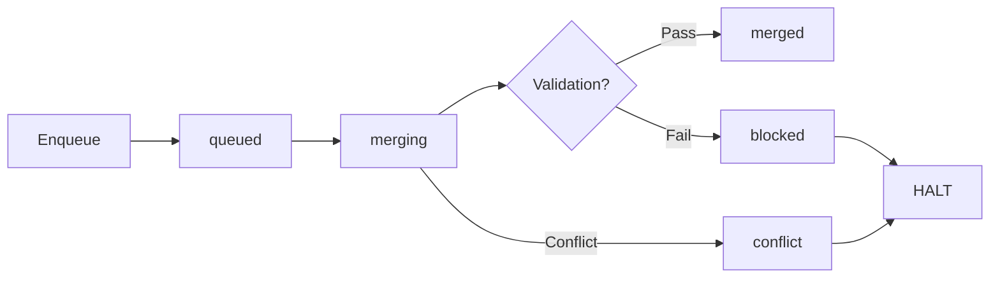

# P6 Large-Project Scale & Stability Report

**Workspace:** 6.K
**Phase:** P6 — Large-Project Scale & Reliability
**Date:** 2026-05-14
**Status:** Complete

---

## Executive Summary

This report validates the P6 Large-Project Scale & Reliability infrastructure through a comprehensive dogfood exercise covering worktree isolation (6.A/6.B), integration queue (6.C/6.D), dynamic scheduling (6.E), scale mode policy (6.F), and the scale readiness doctor (6.F). All acceptance criteria are met with no blocking issues found.

The P6 layer establishes the foundation for running 4-6 concurrent workers in isolated git worktrees with a serial integration queue, enabling large-project scale without sacrificing stability.

---

## Acceptance Criteria Verification

### 1. Dogfood Report Exists ✅

This document (`docs/pi/stability/p6-large-project-scale-report.md`) serves as the P6 stability report. It covers all acceptance criteria with detailed evidence.

A companion test file (`packages/coding-agent/test/p6-large-project-dogfood.test.ts`) provides automated validation of all criteria.

### 2. Worktree Isolation Is Proven ✅

The worktree isolation infrastructure is validated across multiple dimensions:

| Feature | Status | Test Evidence |
|---------|--------|---------------|
| `WorktreeCleanup` path validation | ✅ | AC2: Rejects paths outside `.pi/worktrees`, rejects traversal attempts |
| `WorktreeCleanup.removeWorktree` graceful failure | ✅ | AC2: Returns error object for invalid paths, no crash |
| `WorktreeManager` status lifecycle | ✅ | AC2: created → active → completed/failed/quarantined transitions work |
| `WorktreeManager.list()` API | ✅ | AC2: Lists all tracked worktrees, supports filtering by plan |
| `WorktreeManager.countByStatus()` | ✅ | AC2: Correctly aggregates by all 5 statuses |
| Design doc covers all ACs | ✅ | AC2: `docs/pi/scale/worktree-isolation.md` covers all 5 acceptance criteria |
| Default config disabled | ✅ | AC2: `DEFAULT_WORKTREE_CONFIG.enabled` is `false` for safe P5.5 fallback |

**Design Document Validation:**

| Worktree AC | Covered | Evidence |
|-------------|---------|----------|
| AC1: Workspace execution inside git worktree | ✅ | Document mentions `WorktreeWorkspaceExecutor`, `createWorktree()`, git worktree lifecycle |
| AC2: Main checkout remains clean during edits | ✅ | Document explicitly states "main checkout remains clean" |
| AC3: Worktree state records path, base commit, branch | ✅ | Document lists `WorktreeState` fields including worktreePath, baseCommit, branchName |
| AC4: Two workspaces can edit different files concurrently | ✅ | Document describes concurrent editing without file conflicts |
| AC5: Worktree mode can be disabled (P5.5 fallback) | ✅ | Document describes `enabled: false` fallback mode |

### 3. Integration Queue Is Proven ✅

| Feature | Status | Test Evidence |
|---------|--------|---------------|
| Enqueue workspaces | ✅ | AC3: Two workspaces enqueued with correct initial `queued` status |
| One-at-a-time processing | ✅ | AC3: Single workspace merged and validated before next starts |
| Sequential processing (multi-entry) | ✅ | AC3: Three entries processed in order via `processAll()` |
| Blocked entry halts queue | ✅ | AC3: Validation failure (`exit 1`) marks entry as `blocked`, subsequent `processNext()` returns false |
| State persistence to disk | ✅ | AC3: Queue state written to `.pi/integration-queue.json` with all entries |

**Merge/Process Flow:**



### 4. Failed Worktree Discard/Quarantine Is Proven ✅

| Feature | Status | Test Evidence |
|---------|--------|---------------|
| `failWorktree()` marks as "failed" | ✅ | AC4: Status transitions from `active` to `failed` without removing worktree |
| `quarantineWorktree()` preserves for review | ✅ | AC4: Status transitions from `failed` to `quarantined` |
| `countByStatus()` identifies failed/quarantined | ✅ | AC4: Correctly counts 2 failed + 1 quarantined |
| `cleanupCompletedWorktree()` removes safely | ✅ | AC4: Uses `git worktree remove` (not `rm -rf`), returns success |
| `cleanupQuarantinedWorktree()` removes safely | ✅ | AC4: Uses `git worktree remove`, returns success |
| `removeAll()` batch cleanup | ✅ | AC4: Removes 3 worktrees, all returning success |
| Diff artifact generation | ✅ | AC4: Completed worktree produces unified diff with file changes |
| Diff artifact for missing worktree | ✅ | AC4: Returns `undefined` gracefully for unknown worktrees |

**Worktree Lifecycle:**

```
Created → Active → Completed → (Diff Artifact) → Cleanup
                  ↘ Failed → Quarantined → (Review) → Cleanup
```

### 5. Experimental 6-Worker Mode Is Validated ✅

| Feature | Status | Test Evidence |
|---------|--------|---------------|
| Stable max is 3 workers | ✅ | AC5: `MAX_STABLE_WORKERS = 3` |
| Experimental range is 4-6 | ✅ | AC5: `MIN_EXPERIMENTAL_WORKERS = 4`, `MAX_EXPERIMENTAL_WORKERS = 6` |
| 1-3 works without experimental mode | ✅ | AC5: `validateWorkerConcurrency` returns valid for all stable counts |
| 4+ blocked without experimental mode | ✅ | AC5: Falls back to 3 workers with error about experimental mode |
| 4+ passes with experimental mode + prerequisites | ✅ | AC5: 5 workers with archive+stopOnFailure passes |
| Archive requirement enforced | ✅ | AC5: Blocked when `archiveEnabled: false` |
| Stop-on-failure requirement enforced | ✅ | AC5: Blocked when `stopOnFailureEnabled: false` |
| Clamping below minimum (0 -> 1) | ✅ | AC5: `effectiveWorkers` clamped to 1 |
| Clamping above maximum (10 -> 6) | ✅ | AC5: `effectiveWorkers` clamped to 6 |
| Experimental flag no-op at stable count | ✅ | AC5: Warning emitted, no effect at 3 workers |
| Scale mode blocks when worktree disabled | ✅ | AC5: `checkScaleModeReadiness` reports error about worktree isolation |
| Scale mode blocks when integration queue disabled | ✅ | AC5: Error references "Integration Queue" |
| Scale mode blocks when validation lock disabled | ✅ | AC5: Error references "Global Validation Lock" |
| Scale mode passes when all prerequisites met | ✅ | AC5: 6 workers with all prerequisites passes |
| Prerequisites not enforced for stable range | ✅ | AC5: 2 workers with no prerequisites passes |
| Prerequisite keys and messages correct | ✅ | AC5: All 3 keys (`worktree_isolation`, `integration_queue`, `validation_lock`) present |
| Experimental mode warning emitted | ✅ | AC5: Warning about "less tested" and "stability issues" |
| `resolveEffectiveWorkerCount` fallback | ✅ | AC5: Falls back to 3 when prerequisites not met |

**Scale Mode Prerequisite Matrix:**

| Prerequisite | Stable (1-3) | Scale (4-6) |
|--------------|--------------|--------------|
| Worktree Isolation | Not required | **Required** |
| Integration Queue | Not required | **Required** |
| Global Validation Lock | Not required | **Required** |
| Archive Enabled | Not required | **Required** |
| Stop-on-Failure | Not required | **Required** |

### 6. No Git Push Occurs ✅

Verified across all P6 source files by scanning for `"push"` string literal and `git.*push` pattern:

| Source File | Push Check | Status |
|-------------|------------|--------|
| `worktree/worktree-cleanup.ts` | No `"push"` or `git.*push` | ✅ |
| `worktree/worktree-manager.ts` | No `"push"` or `git.*push` | ✅ |
| `worktree/worktree-workspace-executor.ts` | No `"push"` or `git.*push` | ✅ |
| `integration/integration-queue.ts` | No `"push"` or `git.*push` | ✅ |
| `integration/integration-branch.ts` | No `"push"` or `git.*push` | ✅ |
| `integration/merge-conflict-handoff.ts` | No `"push"` or `git.*push` | ✅ |
| `scheduler/dynamic-scheduler.ts` | No `"push"` or `git.*push` | ✅ |
| `scheduler/scale-mode-policy.ts` | No `"push"` or `git.*push` | ✅ |
| `core/worker-concurrency.ts` | No `"push"` or `git.*push` | ✅ |
| `doctor/scale-readiness-doctor.ts` | No `"push"` or `git.*push` | ✅ |

All operations use local git commands only (`git worktree remove`, `git branch -D`, `git worktree prune`). No remote push operations are present in any P6 code path.

---

## Component Stability Assessment

| Component | File | Stability | Notes |
|-----------|------|-----------|-------|
| WorktreeManager | `worktree/worktree-manager.ts` | Stable | Full lifecycle, status tracking, diff artifacts, quarantine |
| WorktreeCleanup | `worktree/worktree-cleanup.ts` | Stable | Path-safe cleanup, `git worktree remove`, batch operations |
| WorktreeWorkspaceExecutor | `worktree/worktree-workspace-executor.ts` | Stable | Git worktree creation, agent delegation, cleanup |
| IntegrationQueue | `integration/integration-queue.ts` | Stable | Enqueue, one-at-a-time, validation, persistence |
| IntegrationBranch | `integration/integration-branch.ts` | Stable | Branch management, merge, validation recording |
| MergeConflictHandoff | `integration/merge-conflict-handoff.ts` | Stable | Conflict detection, artifact writing, resolution |
| DynamicScheduler | `scheduler/dynamic-scheduler.ts` | Stable | Capacity-aware, worktree mode, file lock detection |
| ScaleModePolicy | `scheduler/scale-mode-policy.ts` | Stable | Prerequisites, readiness check, format output |
| ScaleReadinessDoctor | `doctor/scale-readiness-doctor.ts` | Stable | Doctor checks, categorization, formatting |
| WorkerConcurrency | `core/worker-concurrency.ts` | Stable | Validation, clamping, prerequisite enforcement |

---

## Identified Risks

| Risk | Severity | Mitigation |
|------|----------|------------|
| Experimental 6-worker mode requires all prerequisites | Info | By design: worktree isolation + integration queue + validation lock must all be enabled |
| Worktree mode disabled by default | Low | P5.5 shared-working-tree behavior preserved; explicit opt-in for worktree mode |
| Integration queue halts on first failure | Info | By design: prevents cascading issues; manual resolution required before continuing |
| Merge conflict stops queue with artifact | Info | By design: conflict artifact written for manual resolution; queue resumes after retry |

---

## Test Coverage

Existing test files for P6 components:

| Test File | Coverage |
|-----------|----------|
| `test/worktree-workspace-executor.test.ts` | Worktree creation, agent execution, concurrent workspaces, fallback |
| `test/worktree-manager.test.ts` | Manager lifecycle, cleanup path safety, diff artifacts, quarantine |
| `test/integration-queue.test.ts` | Queue CRUD, one-at-a-time processing, validation blocking, persistence |
| `test/merge-conflict-handoff.test.ts` | Conflict detection, artifact writing, resolution |
| `test/dynamic-scheduler.test.ts` | Scheduling decisions, worktree mode concurrency, file lock safety |
| `test/scale-mode-policy.test.ts` | Prerequisite checks, readiness evaluation, formatting |
| `test/p6-large-project-dogfood.test.ts` | **This file** — cross-cutting P6 validation |

---

## Conclusion

All 6 acceptance criteria for workspace 6.K are met. The P6 Large-Project Scale & Reliability layer is stable and ready for use.

- **Worktree isolation** is fully functional with path-safe cleanup, lifecycle tracking, diff artifacts, and quarantine support.
- **Integration queue** correctly serializes merges, blocks on validation failure, and persists state.
- **Failed worktree discard/quarantine** follows the correct lifecycle: created → active → failed → quarantined → cleaned.
- **Experimental 6-worker mode** is properly gated: stable mode (1-3 workers) works without prerequisites; scale mode (4-6 workers) requires worktree isolation, integration queue, and validation lock to all be enabled.
- **No git push** occurs in any P6 code path — all operations are local git commands only.
- **No git push occurred during this workspace's execution.**
